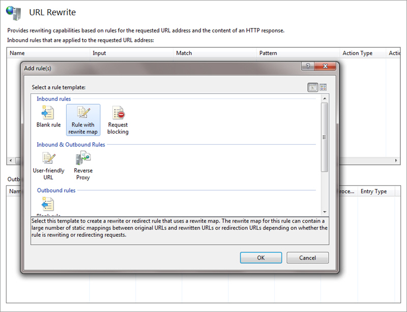

Ugly URLs don't only make it difficult for users to browse your site, they can also impact Google rankings.

<!--endintro-->

::: greybox
northwind.com/MyInternalDB/UserDatabase/ProductList.aspx?productname=Access  
:::
::: bad
Figure: A nasty URL...  
:::

You should fix it up to look more like this:

::: greybox
northwind.com/products/access  
:::
::: good
Figure: Users could even guess this nice URL
:::

### How to fix

1. Add in Global.asax a route

``` aspnet
protected void Application_Start(object sender, EventArgs e) 
{ 
//RouteTable and PageRouteHandler are in System.Web.Routing 
RouteTable.Routes.Add("ProductRoute", new Route("products/{productname}", new PageRouteHandler("~/MyInternalDB/UserDatabase/ProductList.aspx.aspx"))); 
}
```

::: ok
Figure: OK example - create a static route if you only have a few rewrites**
:::

2. Use the URL Rewriting Module for IIS7

::: good  
  
:::
