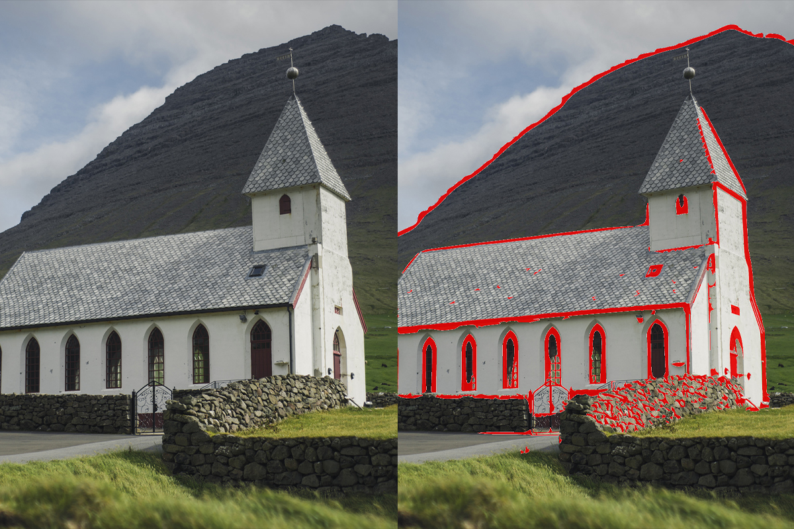

Focus peaking is a valuable tool that assists videographers and filmmakers in achieving precise and accurate focus in their shots.

It highlights the areas of the image that are in sharp focus with a distinct and often colourful outline. This visual aid is superimposed onto the live view or monitor display, making it easier for the videographer to identify the focal points within the frame.

Focus peaking is included in most professional video cameras and external video monitors.

:::bad

:::

:::good

:::