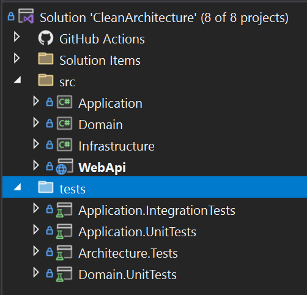
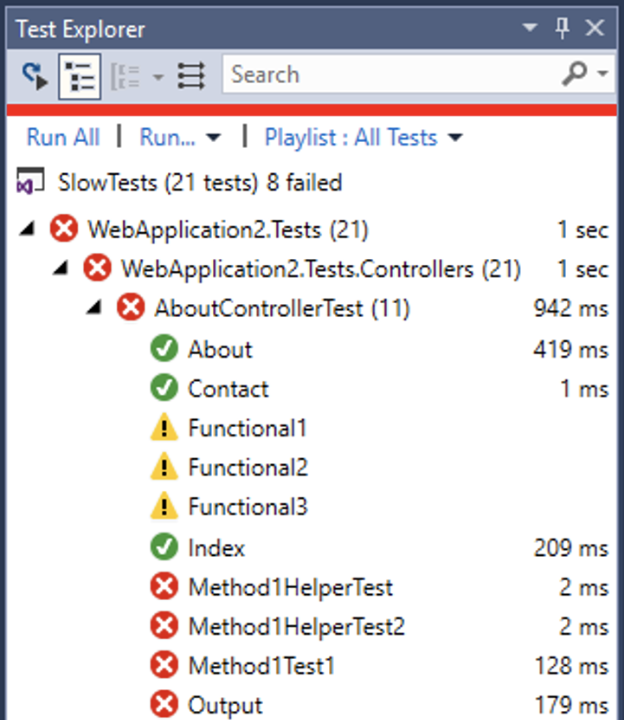

### Test Projects

Tests typically live in separate projects – and you usually create a project from a template for your chosen test framework.
Because your test projects are startup projects (in that they can be independently started), they should target specific .NET runtimes and not just .NET Standard.
A unit test project usually targets a single code project.

### Project Naming

Integration and unit tests should be kept separate and should be named to clearly distinguish the two.
This is to make it easier to run only unit tests on your build server (and this should be possible as unit tests should have no external dependencies).
Integration tests require dependencies and often won't run as part of your build process.  These should be automated later in the DevOps pipeline.

<!--endintro-->

### Test Project Location

Test projects can be located either:

* Directly next to the project under test – which makes them easy to find, or
* In a separate "tests" location – which makes it easier to deploy the application without tests included



Source: [github.com/SSWConsulting/SSW.CleanArchitecture](https://github.com/SSWConsulting/SSW.CleanArchitecture)

### Naming Conventions for Tests

There are a few “schools of thought” when it comes to naming the tests themselves.
Internal consistency within a project is important.
It’s usually a bad idea to name tests after the class or method under test – as this naming can quickly get out-of-sync if you use refactoring tools – and one of the key benefits from unit testing is the confidence to refactor!

Remember that descriptive names are useful – but the choice of name is not the developer’s only opportunity to create readable tests.

* Write tests that are easy to read by following [the 3 A's (Arrange, Act, and Assert)](/how-to-structure-a-unit-test)
* Use a good assertion library to make test failures informative (e.g. [FluentAssertions](https://fluentassertions.com) or [Shouldly](https://github.com/shouldly/shouldly))
* Use comments and refer to bug reports to document the “why” when you have a test for a specific edge-case
* Remember that the F12 shortcut will navigate from the body of your test straight to the method you’re calling
* The point of a naming convention is to make code more readable, not less - so use your judgement and call in others to verify your readability

::: bad

:::

## Option 1: \[Method/Class]\_\[Condition]\_[ExpectedResult] (Recommended)

```cs
[Method/Class]_[Condition]_[ExpectedResult]
```

**Figure: The naming convention is effective – it encourages developers to clearly define the expected result upfront without requiring too much verbosity**

Think of this as 3 parts, separated by underscores:

* The System Under Test (SUT), typically the method you're testing or the class
* The condition: this might be the input parameters, or the state of the SUT
* The expected result, this might be output of a function, an exception or the state of the SUT after the action

The following test names use the naming convention:

```cs
Withdraw_WithInvalidAccount_ThrowsException
Checkout_WithCountryAsAustralia_ShouldAdd10PercentTax
Purchase_WithBalanceWithinCreditLimit_ShouldSucceed
```

::: good
Figure: Good example - Without looking at code, it's clear what the unit tests are trying to do
:::

## Option 2: \[Given]\_\[When]\_\[Then]

```cs
[Given]_[When]_[Then]
```

**Figure: The naming convention is useful when working with Gherkin statements or BDD style DevOps**

Following a Gherkin statement of:

> GIVEN I am residing in Australia
> WHEN I checkout my cart
> THEN I should be charged 10% tax

This could be written as:

```cs
GivenResidingInAustralia_WhenCheckout_ThenCharge10PercentTax
```

## Conclusion

Remember, pick what naming method works for your team & organisation's way of working ([Do you understand the value of consistency?](/the-value-of-consistency/)). Then record it in your team's [Architectural Decision Records](/do-you-use-architectural-decision-records/)

## Resources

For more reading, the read the [Microsoft guidance on Unit testing best practices](https://learn.microsoft.com/en-us/dotnet/core/testing/unit-testing-best-practices)

A list of other suggested conventions can be found here: [7 Popular Unit Test Naming Conventions](https://dzone.com/articles/7-popular-unit-test-naming).
