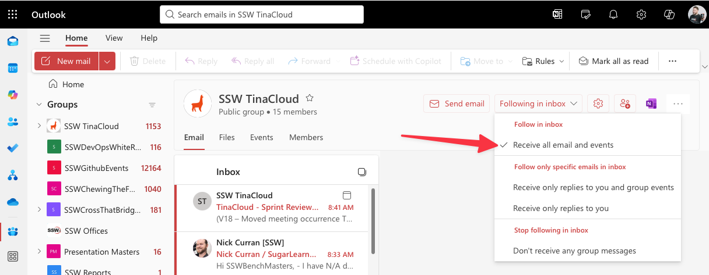
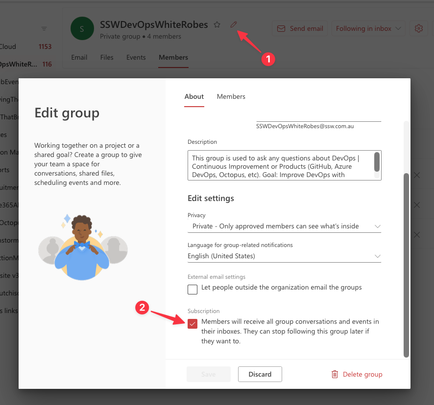

If you’ve ever missed important emails from an Outlook Group, despite being a member, it’s likely you weren’t following the group in your inbox. This can be especially confusing when those messages don’t show up in search results or your inbox, even though you technically "have access."

<!--endintro-->

When you're added to an Outlook Group, you **don’t automatically receive group messages in your inbox** — they only show up in the group’s shared mailbox. If you want those messages to behave like regular emails (appear in your inbox and show up in search), you need to explicitly follow the group.

### How to follow an Outlook Group in your inbox

1. Open Outlook and go to the left-hand navigation pane.
2. Under **Groups**, find the group you're a member of.
3. Click on the group (e.g. "SSW TinaCloud").
4. At the top-right of the message panel, click the dropdown next to **Following in inbox**.
5. Select **Receive all email and events**.

::: good

:::

### Admins: Set this as the default for new members

If you’re an admin of the group, you can set this to be the default so all members automatically follow the group in their inbox when they’re added. This prevents confusion and ensures new members don’t miss important updates.

1. Go to the group’s **Members** tab.
2. Click the pencil icon to edit the group settings.
3. Check the **Subscription** box:\
   *“Members will receive all group conversations and events in their inboxes.”*

::: good

:::

### Why this matters

* **Search works properly** – If you don’t follow the group, messages won’t appear in your normal email search.
* **Consistency** – You’ll get emails the same way you get all other mail, making it easier to keep up with group activity.
* **Inbox Zero still works** – You can still manage and triage these messages with your usual workflow.

If you’re missing group emails, this setting should be your first check.
