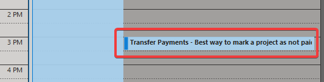

Sometimes you can't complete a task right away or anytime soon. People might just say: _"I can't do this week, but I should have it done by the end of next week"_.

Another scenario is when the task should be done or will expire after a period of time. For example _"Send Google Analytics data after a month"_ or _"Remove course banner once the course is completed"_.

If you leave it like that there is a high chance it gets forgotten as remembering tasks is a highly unreliable method.

Efficient people don't rely on their memory and instead, use some way to make sure they don't forget to do that task. Common ways are to make a note in a paper diary or stick a post-it note to a screen, but **there are better ways**.

<!--endintro-->

`youtube: https://www.youtube.com/embed/-x4_3iruBNY`

::: bad

:::

To ensure you follow up on tasks, it is important to set up an action point so it can be forgotten until later. That frees up cognitive space so you can focus on something else but still be certain it will be actioned later. 

### The Tools

There are some okay tools like delayed send and follow up flags... but the gold standard tools are:

* Email - Followupthen.com
* Phone - Reminders
* Microsoft Teams
  * Schedule send
  * Remind App 
* Calendar - Meetings
* Sprints - Creating a PBI

### Email - followupthen.com

[FollowUpThen](https://www.followupthen.com) is the best tool to use when a task arrives in your inbox that you want to make sure gets completed. It does all the administrative work for you.

Simply BCC or email **&lt;period of time&gt;@followupthen.com** and it will send you an email when that time expires, reminding you to follow up with another email.

::: good

:::

**Note:** This email thread is sent to a 3rd party, so strip out any confidential information before using this tool.

### Email Alternative - Outlook | Options | Delay Delivery

Delay delivery is an alternative to followupthen that involves scheduling emails to be sent later. It is integrated directly into outlook but Outlook must be open for it to send, and if someone writes back before the delay then it could become irrelevant. 

To use it:

Write yourself an email in Outlook.  
Before pressing send, click **Options** | **Delay Delivery**, and then specify when you want to be reminded.

The email will sit in your outbox until the required time, when it will be sent to whoever you specified (you in this case).  
When you receive it in your inbox, action the task.

::: ok

:::

### Email Alternative - Outlook | Follow Up flag

Follow Up Flags are a third alternative for email reminders. It is also integrated with Outlook but it's main problem is it just gives a notification instead of an email to be actioned. That means it is transitory and could be missed.

To use it:

1. Click the Follow Up button 

2. Select an appropriate date from the drop-down or choose Custom to add additional reminders 
     

You can even set a custom reminder for the recipient :)

3. Outlook shows an info tip with the exact follow-up date you chose
4. A To-Do item is also added to your Outlook To-Do list 

  **Note:** To-Do list can be found in the Tasks pane.

5. On the due date you will receive a Reminder popup from Outlook
6. If you chose to add a custom reminder you will also receive a Reminder popup from Outlook

::: ok

:::

### Teams – Schedule Send 
Here is a practical and useful feature in Teams. 
* Right click the send button to schedule all the important messages in advance.

### Teams – Remind App
https://appsource.microsoft.com/en-us/product/office/wa200001444?tab=overview
* Never forget a thing. Remind yourself or your team members of important meetings, to-do items or even birthdays. 
* Set personal reminders, group chat reminders or channel reminders. You can even set recurring reminders (e.g. a team meeting every Monday at 9am)!

### Phone - Reminders

Phone reminders made via Siri or Google Assistant are awesome when there are things that should be actioned immediately after receiving the reminder. 

For example, if Jane knows she wants to film a video at 8am tomorrow then she might ask Siri to remind her at 7:55am. Then when she gets the reminder she knows to film the video right then.

::: good

:::

### Calendar - Meetings

If more than one person needs to be coordinated, then meetings are the best way to go about it.

Meetings draw everyone's attention and block out their calendar. 

If someone doesn't show up to the meeting, just call them in. If you still don't get a response and they are critical to the meeting then re-schedule it for later to make sure there is a new action point.

Also make sure to send an email with an action point at the end of the meeting, you never want to end a meeting without action points. You can even use followupthen to make sure you follow up on it!

::: good

:::

### Sprints - Creating a PBI or task

If working in an agile team it is important for everyone to have visibility of PBIs and tasks. So, if you know something needs to be actioned, then you should always create a PBI or task.

Sprints also naturally act as a follow up since the tasks will be discussed in the Daily Scrum and Sprint meetings.

::: good

:::
