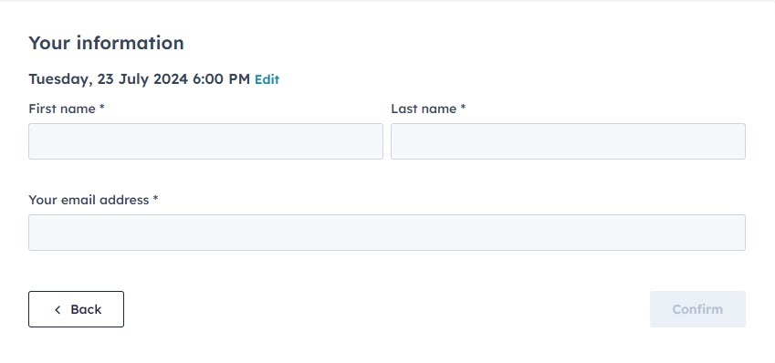

When web users fill out a form to make an appointment or download an ebook, it's common for businesses to collect basic contact details. Unfortunately, many forms neglect to ask for a mobile number, or if they do, they don't make it a required field. This oversight can lead to missed opportunities for follow-up and conversion.      
       
<!--endintro-->      
       
## The Importance of Phone Follow-Ups      
       
### Why It Matters      
     
Following up with a phone call can dramatically increase the likelihood of converting a lead into a customer. A phone call adds a personal touch, builds trust, and allows for immediate engagement and clarification. In fact, a majority of sales are completed over the phone, highlighting the importance of this method.    
     
### Key Points        
     
1. **Instant Connection:** A phone call provides a direct line to the prospect, allowing you to answer questions and address concerns in real-time
2. **Personal Touch:** Hearing a human voice can create a more personal connection than an email or text message
3. **Immediate Feedback:** You can gauge the prospect's interest and adjust your approach based on their responses

Most forms only ask for an email address, leaving out the phone number. This limits the ways you can follow up with a lead.

 
::: bad     

          
   
:::        
     
#### Not Making Phone Number Required        
        
Even when forms include a phone number field, it's often optional. This results in incomplete contact information for many leads.        
       
::: bad      

Figure: Bad Example - The phone number is not required, leading to many leads without a phone number       

:::         
          
### Best Practices          
          
#### Always Ask for Phone Numbers         
        
Include a phone number field in all your forms and make it a required field. This ensures you have the necessary information to follow up with leads effectively.        
     
::: good       
           

:::         
        
#### Prioritize Phone Follow-Ups        
         
Train your sales team to prioritize phone calls when following up with leads. Scripts can help ensure that all key points are covered during the conversation.      
               
By collecting phone numbers and following up with a phone call, you can significantly increase your chances of converting online leads into customers. Make sure your forms are designed to gather all necessary contact information, and prioritize personal, immediate follow-ups to build trust and engagement with your prospects.         
         

     