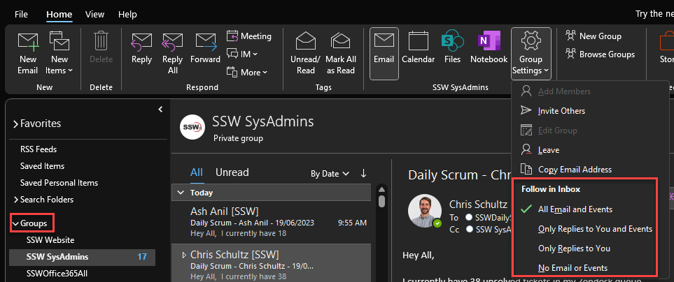
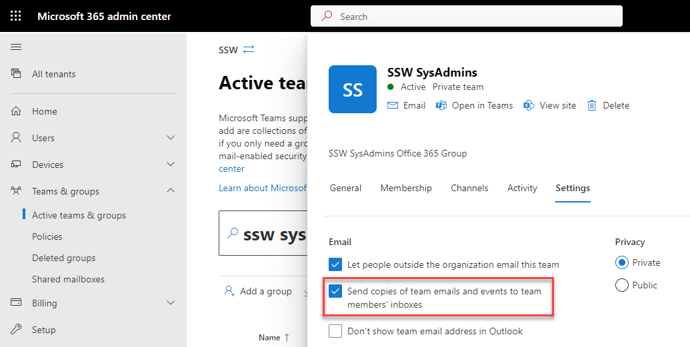

Groups in Microsoft 365 let you choose a set of people that you wish to collaborate with and easily set up a collection of resources for those people to share. Resources such as a shared Outlook **inbox**, shared **calendar**, a **team** for conversations, or a **document library** for collaborating on files, etc.

One really useful setting in Microsoft 365 Groups is the option to follow/unfollow groups.

When you **follow** a Group in Outlook, all group conversations and calendar events will be sent to both the group mailbox and your personal inbox. This is particularly helpful when you belong to multiple groups and want to stay on top of the conversations from one location.

However, emails can be noisy, and you may want to reduce the number of emails received by **unfollowing** it. 

Below are some use cases:

<!--endintro-->

::: greybox
**A.** You have a group that receives a lot of emails that do not need to be actioned, but may need to be found at a later date. You can happily unfollow this group, remove the noise from your inbox, and check the group folder later if needed.
:::

::: greybox
**B.** You have a team where one person is the main point of contact - but others need to help out occasionally. For example, if you own a lot of domains, you will receive many emails about their renewals. It is good practice to have one person managing this - but it is also good practice to have the emails going to a group (not just an individual). Other members of the team can unfollow the group, and only check the folder if the responsible person is unavailable.
:::

### Follow/unfollow settings

#### As a user

To follow or unfollow a group in Outlook:

1. Go to the group in the navigation pane
2. Go to **Group Settings** in the ribbon
3. Choose which items you would like to receive in your inbox



:::info
Note: This functionality is not available on Outlook for Mac. If you want to change these settings, use the [OWA](https://outlook.office.com/mail)
:::

#### As an administrator (Microsoft 365 admin center)

When you set up a new Microsoft 365 group, you can choose the default behaviour for members of the group.

1. Go to **Microsoft 365 admin center | Teams & groups | Active teams & groups** and click on the group
2. Go to **Settings**
3. Check or uncheck **Send copies of team emails and events to the team members' inboxes**



:::info
**Note:** This will not change the behaviour for existing members. For this, you will need to use PowerShell (see below).
:::

#### As an administrator (PowerShell)

For more granular options, you can use PowerShell to view and edit settings for individual members of the group.

```powershell
# Connect to Exchange Online
Connect-ExchangeOnline

# View the group follow settings
Get-UnifiedGroup -Identity {{ group }} | fl Identity, DisplayName, AutoSubscribeNewMembers

# Enable or disable the above
Set-UnifiedGroup -Identity {{ group }} -AutoSubscribeNewMembers
Set-UnifiedGroup -Identity {{ group }} -AutoSubscribeNewMembers:$false

# Get a list or group members
Get-UnifiedGroupLinks -Identity {{ group }} -LinkType Members

# Check who is following the group
Get-UnifiedGroupLinks -Identity {{ group }} -LinkType Subscribers

# Add or remove people from following the group
Add-UnifiedGroupLinks -Identity {{ group }} -LinkType Subscribers -Links {{ User }}
Remove-UnifiedGroupLinks -Identity {{ group }} -LinkType Subscribers -Links {{ User }}
```
