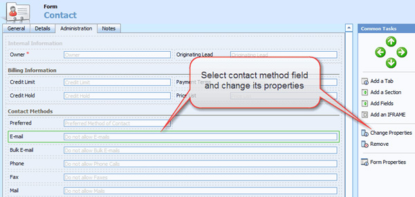

<dl class="badImage">          &lt;dt&gt;
            &lt;/dt&gt;
          <dd>
            Figure: Bad Example - By default CRM uses option group for contact's and account's
            contact methods.</dd>
        </dl>
<!--endintro-->

As per our rule [Do you know when to use CheckBox?](http://www.ssw.com.au/SSW/standards/rules/RulesToBetterInterfacesEdit.aspx#UseCheckBox). Checkboxes should be used instead of the           option group since the answer is a boolean type. You can change the option group           to checkboxes by:

1. From CRM, go to Settings | Customizations | Customize Entities
2. Double-Click "Contact" entity
3. Click "Form and Views"
4. Double-Click "Form" to edit contact form
5. Click "Administration" tab
6. Select a contact method field, i.e. Email
7. Click "Change Properties"             <dl class="image">              &lt;dt&gt;
                &lt;/dt&gt;
              <dd>
                Figure: Select and change the email field's properties.</dd>
            </dl>
8. Click "Formatting" tab
9. Change layout from "Two Columns" to "One Column" and select "Check box" as control             formatting
<dl class="image">            &lt;dt&gt;
              &lt;/dt&gt;
            <dd>
              Figure: Change layout and control formatting of email field to one column type and
              check box.</dd>
          </dl>10. Repeat steps 6-9 for other contact method
11. Repeat steps 3-9 for account entity

<dl class="goodImage">          &lt;dt&gt;
            &lt;/dt&gt;
          <dd>
            Figure: Good example - Checkboxes are used for contact methods because they're clear
            and simple.</dd>
        </dl>
