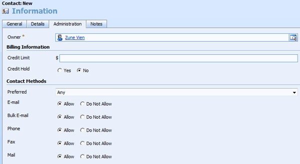
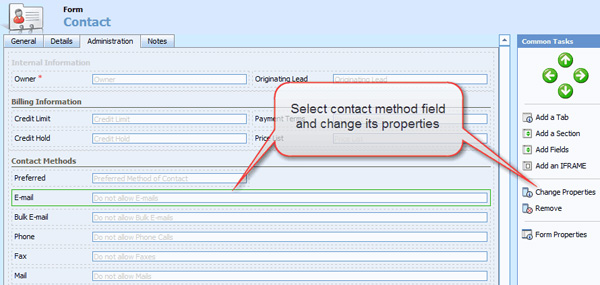
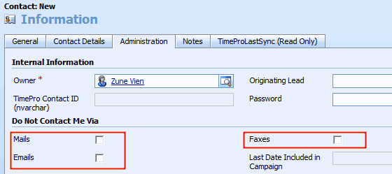

<dl class="badImage">
          <dt>
            </dt>
          <dd>
            Figure: Bad Example - By default CRM uses option group for contact's and account's
            contact methods.</dd>
        </dl>

 <excerpt class='endintro'></excerpt> 
 

          As per our rule <a href="http://www.ssw.com.au/SSW/standards/rules/RulesToBetterInterfacesEdit.aspx#UseCheckBox">
            Do you know when to use CheckBox?</a>. Checkboxes should be used instead of the
          option group since the answer is a boolean type. You can change the option group
          to checkboxes by:
        

        <ol>
          <li>From CRM, go to Settings | Customizations | Customize Entities</li>
          <li>Double-Click "Contact" entity</li>
          <li>Click "Form and Views"</li>
          <li>Double-Click "Form" to edit contact form</li>
          <li>Click "Administration" tab</li>
          <li>Select a contact method field, i.e. Email</li>
          <li>Click "Change Properties"
            <dl class="image">
              <dt>
                </dt>
              <dd>
                Figure: Select and change the email field's properties.</dd>
            </dl>
          </li>
          <li>Click "Formatting" tab</li>
          <li>Change layout from "Two Columns" to "One Column" and select "Check box" as control
            formatting</li>
          <dl class="image">
            <dt>
              </dt>
            <dd>
              Figure: Change layout and control formatting of email field to one column type and
              check box.</dd>
          </dl>
          <li>Repeat steps 6-9 for other contact method</li>
          <li>Repeat steps 3-9 for account entity</li>
        </ol>
        <dl class="goodImage">
          <dt>
            </dt>
          <dd>
            Figure: Good example - Checkboxes are used for contact methods because they're clear
            and simple.</dd>
        </dl>

