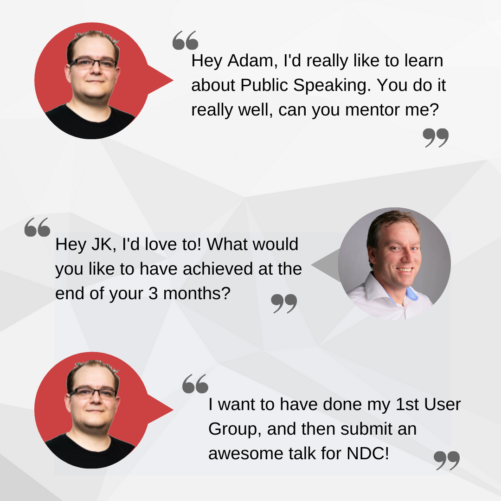

There are a lot of different ways to mentor someone. You can use any of the following models:

* Cloning model: The mentor teaches the learner as if they were a clone of the mentor.        
* Nurturing model: The mentor assumes a parental role to create an open, supportive environment where the learner can learn and try things themselves
* Friendship model: The mentor acts more as a peer “Rather than being involved in a hierarchical relationship.
* Apprenticeship model: The mentor and learner predominantly have a professional relationship.

<!--endintro-->

While some mentoring relationships will continue for years, at SSW we have also established a more formal mentoring program based on the nurturing model.

We have many different kinds of mentors, some are for soft skills, some are for technical skills. Some of the things you can learn include:

* Public Speaking
* Developing a great I.T career
* Account Management
* Low Code
* Clean Architecture
* Angular
* Great blogging
* Increasing your social media presence 

## How does it work?

* **A mentee reaches out to someone they know has great skills in a particular area, and they ask to be mentored**
* 1 mentor, 1 mentee
* The formal program runs for 3 months
* You will have 3 x 15 minutes meetings over the course of the 3 months

  * 1st Meeting:

    * Tell the mentor what you would like to achieve by the end of the 3 months
    * Work out your goals & set targets
    * Then the mentee works independently for a month, checking-in when needed
  * 2nd Meeting :

    * The Mentor will review their progress and give tips or suggestions on how to move forward
    * Set new goals
    * Then the mentee works independently for a month, checking-in when needed
  * 3rd Meeting:

    * The Mentor will review their progress and give tips or suggestions on how to move forward
    * Set some longer-term goals
    * Then the mentee works independently, checking in when needed informally