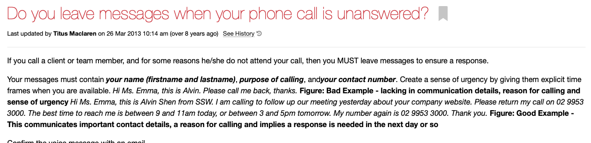
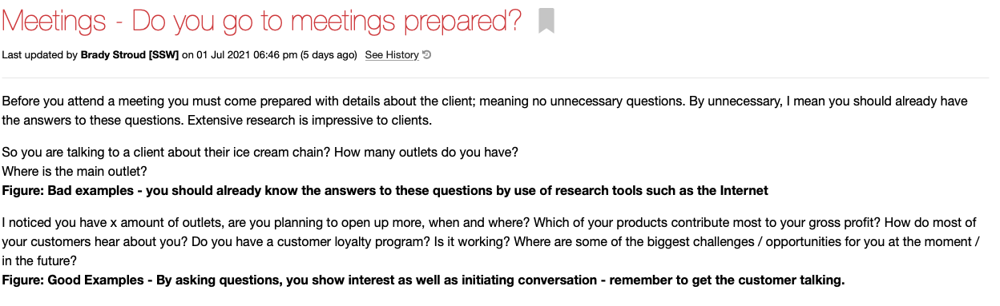

Figure statements can add extra context to your writing but if formatted incorrectly, they can make it confusing and hard to read.  
Always put your figures on a new line so they can be easily differentiated from the other text.

::: bad

:::

::: good

:::