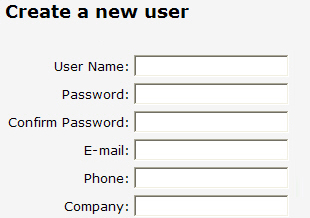

Always indicate which fields are required. Users get frustrated when they experience a wasted trip to the server, just because they did not get an obvious indication of what was required first time around.

<!--endintro-->
<dl class="badImage">&lt;dt&gt;&lt;/dt&gt;<dd>Figure: Bad example - No visual indication for required fields when a user first sees the form</dd></dl>
A designer will know the best way to indicate required field depending on the layout. However if you are in doubt and don’t have a designer around, a red asterisk is definitely the best option.
<dl class="goodImage">&lt;dt&gt;&lt;/dt&gt;<dd>Figure: Good Example - A visual indication of what fields are required (use a red asterisk if you are not a designer)</dd></dl>
#### More Information

You should combine these visual indicators with appropriate client and server side validators to make sure that your data conforms to business requirements. Adding a RequiredFieldValidator to the above textboxes gives you data validity check with minimal coding.
<dl class="badImage">&lt;dt&gt;
<asp:textbox runat="Server" id="email"></asp:textbox>
&lt;/dt&gt;<dd>Figure: Bad Example - No validator used, so the user won't know the email is required</dd></dl><dl class="goodImage">&lt;dt&gt;
<asp:textbox runat="Server" id="email"></asp:textbox>
     <asp:requiredfieldvalidator runat="Server" controltovalidate="email" errormessage="Please enter an email address"></asp:requiredfieldvalidator> ID="emailReqValidator" />
&lt;/dt&gt;<dd>Figure: Good Example - an ASP.NET validator in use, to indicate the fields required</dd></dl>

::: greybox

**Note:** For ASP.NET Dynamic Data although validation is done differently (under the covers it is using a field template + the ASP.NET validator).

:::
