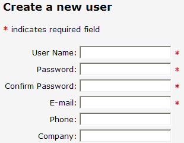

Always indicate which fields are required. Users get frustrated when they experience a wasted trip to the server, just because they did not get an obvious indication of what was required first time around.

 <excerpt class='endintro'></excerpt> 
<dl class="badImage"><dt></dt><dd>Figure: Bad example - No visual indication for required fields when a user first sees the form</dd></dl>
A designer will know the best way to indicate required field depending on the layout. However if you are in doubt and don’t have a designer around, a red asterisk is definitely the best option.
<dl class="goodImage"><dt></dt><dd>Figure: Good Example - A visual indication of what fields are required (use a red asterisk if you are not a designer)</dd></dl><h4>More Information</h4>
You should combine these visual indicators with appropriate client and server side validators to make sure that your data conforms to business requirements. Adding a RequiredFieldValidator to the above textboxes gives you data validity check with minimal coding.
<dl class="badImage"><dt>
&lt;asp:Textbox runat="Server" ID="email" /&gt;
</dt><dd>Figure: Bad Example - No validator used, so the user won't know the email is required</dd></dl><dl class="goodImage"><dt>
&lt;asp:Textbox runat="Server" ID="email"/&gt;
     &lt;asp:RequiredFieldValidator runat="Server" ControlToValidate="email" ErrorMessage="Please enter an email address"
     ID="emailReqValidator" /&gt;
</dt><dd>Figure: Good Example - an ASP.NET validator in use, to indicate the fields required</dd></dl>

<strong>Note: </strong>For ASP.NET Dynamic Data although validation is done differently (under the covers it is using a field template + the ASP.NET validator).​

