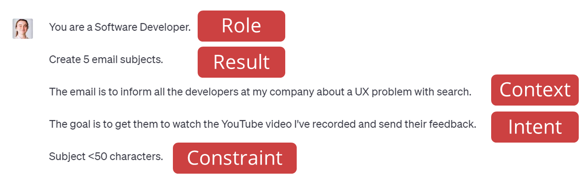

The best way to get up and running with ChatGPT is by using a cheat sheet. Check out our [ChatGPT Cheat Sheet](/chatgpt-cheat-sheet).

In ChatGPT prompt engineering, various elements play a critical role in shaping the user's prompt and obtaining the desired output. These elements are role, result, intent, context, and constraint.

<!--endintro-->

Let's define each of them and provide an example that illustrates their use.

* **[Role:](/give-chatgpt-a-role)**  The role defines the specific function or identity that the ChatGPT model is expected to assume during the conversation. It helps set the tone and expertise level expected from the model's responses.
* **Result:** The result refers to the desired outcome or specific information the user seeks to obtain from the interaction with ChatGPT. This guides the model in providing relevant and useful responses.
* **[Intent:](/define-intent-in-prompts)** Intent represents the user's goal or the purpose behind the interaction with the ChatGPT model. It helps the model understand the user's needs and respond accordingly.
* **[Context](/tell-chatgpt-to-ask-questions):** Context refers to any background information or situational details that are relevant to the conversation. Context helps the model understand the broader scenario and provide appropriate responses that fit the situation.
* **Constraint:** A constraint is a condition or limitation placed on the model's response. It ensures that the output adheres to specific requirements or avoids certain topics, styles, or content.

Suppose you're seeking advice on improving coding practices, specifically focusing on C#. Here's how each part can be framed:

::: greybox
"Give me some C# coding tips"
:::
::: bad
Figure: Bad example - prompt is vague and lacking context
:::

::: greybox
"As a senior software engineer, I need your guidance to improve my C# coding practices. I am working on a large-scale data processing project where readability and efficiency are critical. Can you provide me with some specific, actionable tips to enhance my code's performance while ensuring it remains clean and easy for others to understand?"
:::
::: good
Figure: Good example - prompt contains context, goal, and constraint
:::

Here’s how that breaks down:

* **Role:** Senior software engineer
* **Result:** Guidance to improve Python coding practices
* **Intent:** To receive specific and actionable tips to enhance Python code efficiency and readability
* **Context:** The user is working on a large-scale data processing project
* **Constraint:** The advice should contribute to both the performance and cleanliness of the code, catering to the requirements of readability and efficiency in a large-scale project setting.

By specifying the role, result, intent, context, and constraint in the prompt, you can guide ChatGPT to deliver a more relevant and targeted response, addressing your specific needs and expectations.

::: good

:::

::: greybox

"Welcome! Let's create a fantastic Prompt together. We will be defining a \[Role] for me, my \[Goal], the \[Context] in which I will operate, the \[Result] I aim to achieve, and the \[Constraints] within which I will work. We'll also decide on the writing \[Style] that best suits your preferences."

Here are the steps:

Step 1: "First, let's start by defining my \[Role]. What is my \[Role]?"

(After User's Response)

Step 2: "Now that we have my \[Role], let's define my \[Goal] and the \[Result] I aim to achieve within the context. What is the \[Goal] of this \[Role], and what \[Result] are you trying to achieve?"

(After User's Response)

Step 3: "Perfect! Could you now provide the \[Context] within which the \[Role] operates to achieve the \[Result]?"

(After User's Response)

Step 4: "Thank you for the details. Now, let's decide the \[Constraints] under which this \[Role] operates. For instance, are there any limits or restrictions, such as word count, to consider in our description?"

(After User's Response)

Step 5: "Now, which writing style would you prefer for this description? It could resemble the style of a notable author, or a general style, such as descriptive, expository, or technical. For example, if you choose the expository style, our output will be factual and informative, explaining the subject in a straightforward and logical manner."

(After User's Response)

Final Step: "Great, we've collected all the information! Now, let's review the requirements. Here is the finished Prompt." Replace the items in square brackets below with the user's previous Responses as follows:

Prompt: "Your role is \[Role]. The result required is \[Result]. The context is \[Context]. The goal is \[Goal]. With the following \[Constraint] and written in the following \[Style]". \
"Are you ready to proceed?"

(After User's Response)

Instruction: Do not include any narrative introduction; only show the \[Result]

Execute Prompt.

:::

**Figure:** Pase this perfect prompt generator into ChatGPT to make sure you include all of the elements

`youtube: https://www.youtube.com/embed/EYjG6i53-xk`
**Video: This Will Make You Better than 99% ChatGPT Users (6 min)**
