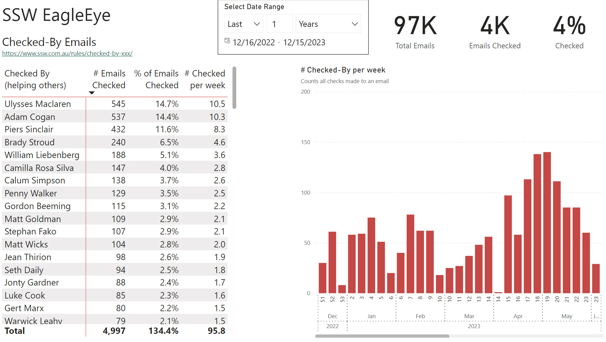
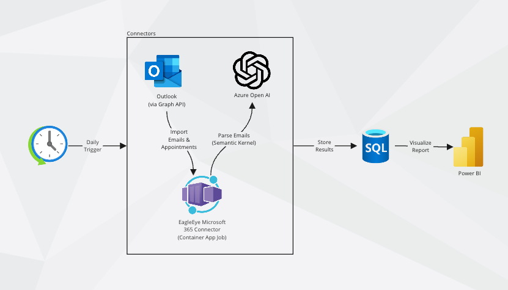

The emails exchanged within your company are more than just communication tools - they are a rich source of data. By analyzing this data, you can:

<!--endintro-->

1. Gain insights into a company's operations
2. Detect bottlenecks
3. Better distribute workload
4. Make strategic decisions

`youtube: https://www.youtube.com/watch?v=-7c6uagBBBM`
**Video: Transforming Company Data into Epic Insights✨ | Isabel Sandstroem | SSW EagleEye (4 min)**

Emails should follow a set of [email rules](/rules-to-better-email) that make communication consistent and structured. When emails have standard format and content, data analysis is possible.

::: good

:::

## Process

The EagleEye process for interacting with Outlook (in Microsoft 365, formally Office 365) is as follows:

1. **Data Collection** - Extract data from Outlook using Microsoft Graph API
2. **Data Transformation** - Transform the data into a format that can be used in Power BI
3. **Data Visualization** - Display the data in Power BI reports

## Architecture

The SSW EagleEye architecture for interacting with Outlook is as follows:

1. **Trigger** - Daily.
2. **Data Collection** - Container App Job pulls email via the Microsoft Graph API for the previous day

**Note:** Only users in a specific group are processed.

1. **Filtering** - Filter out emails that don't match a set of rules using recipients, subject, or body
2. **AI** - We use AI to assist in categorization of emails via semantic kernel and Open AI
3. **Data Persistence** - Store the data in a Azure SQL database
4. **Data Visualization** - Display the data in Power BI reports

## Actionable insights

Collecting data is great, but if you're not creating actionable insights, you're missing out on the real value. Here are some examples of actionable insights you can gain from analyzing company emails:

- **Workload distribution** - Through analyzing company emails, one can assess whether tasks and responsibilities are allocated evenly across teams. By pinpointing areas where workload is disproportionately heavy or light, it's possible to redistribute tasks more equitably, minimizing burnout and optimizing productivity.
- **Project management** - Email analysis can reveal insights into project timelines, milestones, and communication patterns. Identifying inconsistencies or delays in project-related correspondence allows for timely interventions, ensuring projects stay on track and resources are efficiently allocated.
- **Sales** - By examining email exchanges with clients, trends in customer inquiries, preferences, and feedback can be uncovered. This analysis enables the tailoring of sales strategies to better meet customer needs, improve engagement, and boost conversion rates.
- **Finance** - Financial communication, such as budget discussions, expense approvals, and financial reporting, can be scrutinized for insights into the company's fiscal health and spending patterns. Leveraging this information can lead to more informed financial decision-making, cost optimization, and strategic investment planning.

<!--
# Anatomy of an EagleEye rule
=============================
What are we looking at? Email
What are the insights? See bullets above
Video
Tech used / Process of collecting data
Actionable insights - How we change process off the data
-->
