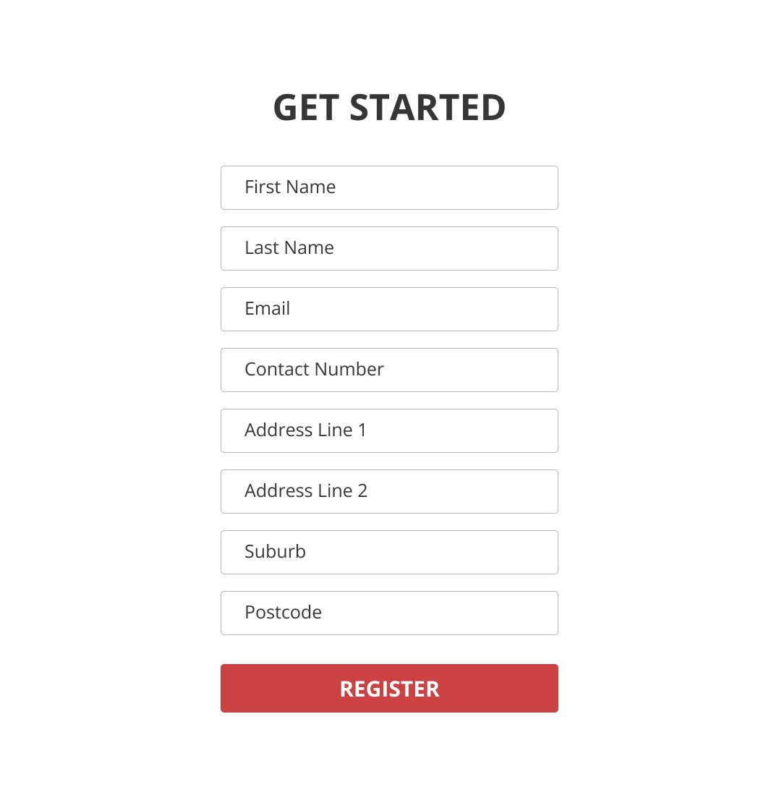
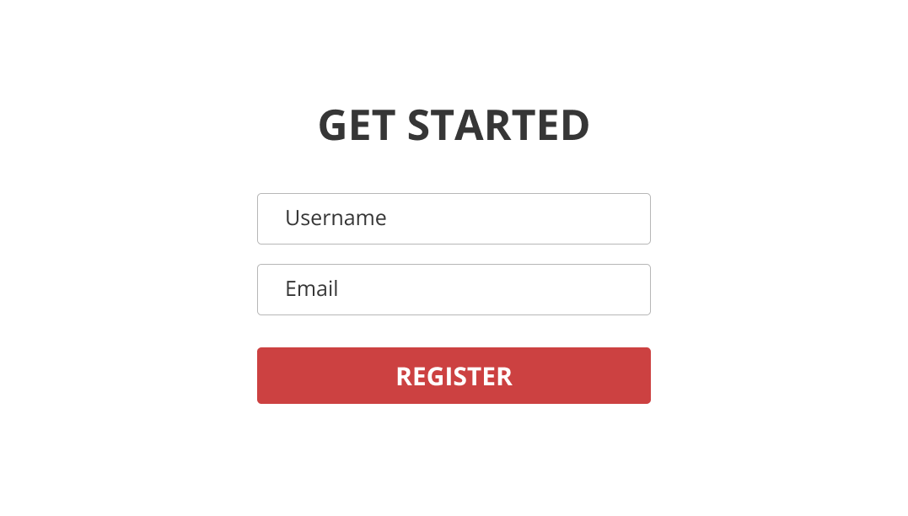

Most people are reluctant to share personal information and may provide false data, especially when asked to disclose a lot of information at once. Collecting personal information in intervals, rather than in a single session, may lead to more accurate and thoughtful answers.

<!--endintro-->

Imagine a scenario where a user visits a website to download software and is requested to provide comprehensive details like their name, email, phone number, and address. In such cases, the likelihood of receiving accurate information tends to decrease. This reluctance usually stems from the user's concerns about the company's intentions for using their data and their unfamiliarity with the company itself. In contrast, if the company initially asks for just a username and email address, users generally feel more comfortable sharing this information.

::: bad

:::

::: good

:::

This approach, being less invasive, is perceived as more user-friendly, increasing the probability of users returning to the site for additional downloads. At this stage, the company can progressively request more information, such as the user's real name and phone number.

Once the user has shared some basic information, he or she often develops a stronger sense of trust towards the company. Therefore, during their third visit for another download, they are more inclined to disclose further personal details. Over a series of interactions, the user eventually provides all the necessary personal information to the company.

This incremental approach to data collection significantly fosters user trust. However, it should be noted that while this strategy reduces the chances of receiving false information, it does not entirely eliminate the possibility.
