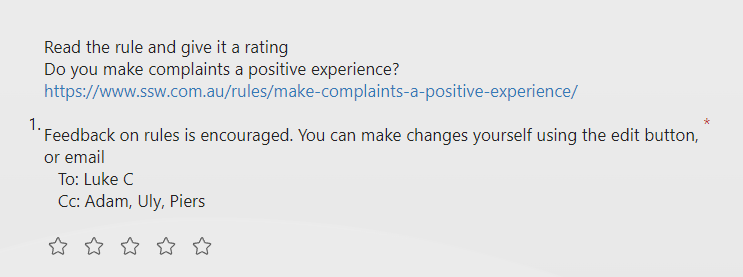

No matter how well adapted your business and processes are, there's always room to improve and learn.
Getting feedback from others, outside the [critical distance](/importance-critical-distance), helps to fine-tune ideas, even if you may think your processes are ideal.

Once you've built a fantastic team of experts, it's important to actively listen to their opinions and ideas to continue building a great place to work and deliver more value to your customers.

Having a regular forum like this is a great way to achieve also achieve 2 other important goals:
1. Educating the team
1. Aligning the company

<!--endintro-->

In the highly dynamic space of software development, there are new frameworks, features and languages constantly being released, hyped, maturing and sunsetting.
No-one has the time to keep up with everything that's going on, so it makes sense to gauge the opinions of your team - there's a good chance that at least one of them has an opinion!

Setting up a regular schedule to collect everyone's opinion is great to build up a habit and ensure that you've always got new ideas coming in.

# Gather Your Team's Opinions

Gathering and actioning these opinions is a relatively straight-forward process.
While it may be tempting to stick to only business oriented topics, it's a good idea to remember that this process works well to spread knowledge around your team and upskill everyone!

This process typically has 4 core steps, performed in a regular cycle:

1. Publish an article on a new technology or process that you'd like to explore as a team
2. Send out a survey to everyone on the team, asking them to review the article and give their feedback
3. Review the results and implement feedback
4. Publish changes

## 1. Publish an article

If you're excited about a shiny new technology or process change that you've read about, choosing a topic for the article will be easy.
Sometimes it may be a bit more difficult, this is where your team could contribute ideas that they want discussed.

Write up an article and publish it somewhere appropriate for your team to access.
Make sure to include [bad and good examples](/use-bad-and-good-examples) to really get your point across.

## 2. Send out a survey

Once the article is published, send out a survey to your team and set a deadline for submissions.
Without a deadline, it's difficult to start the review process as responses can come in well after you've moved on to the next cycle.

In the survey, ask for the team's thoughts on the idea presented in the article. Both positive and negative criticism should be encouraged - the point is to choose the best ideas, bad ideas should be rejected.
A really effective metric to include is a star rating out of 5, this can be averaged to gauge the general sentiment of the team at a glance.

## 3. Review results

Once the deadline has passed, review the survey submissions, taking note of any:

* Particularly high or low ratings
* Suggestions for change
* Ideas for future editions

Don't just cherry-pick the ideas that you immediately like the looks of, it's worth examining (or even better, discussing) any submitted ideas.
Your team members will appreciate feeling heard, so reach out to those members who submitted ideas which you don't agree with or are impractical to discuss why.
Not only will this ensure they feel valued, it will also help teach them your reasoning and improve their future suggestions.

## 4. Publish changes

This process doesn't have much significant value if you don't action any of the submitted suggestions, we are looking to not only educate but improve as we go!
If some ideas from the survey are actioned, make sure to let the team know.
This encourages further feedback in future iterations and is an efficient way to notify everyone of the changes.

# Stay Regular

It may sometimes be tempting to skip a scheduled cycle, but to maintain habits, it's important to try to send one out anyway.
To ensure you always have something ready to go, set up a repeating meeting a few days before the scheduled release date each cycle to review or create the content.