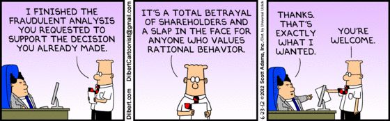

​​​
                    If someone asks you to do something you believe is unethical please ring them up
                    straight away and discuss the issue.
                 

 <excerpt class='endintro'></excerpt> 
<dl class="ssw15-rteElement-ImageArea">​</dl><dd class="ssw15-rteElement-FigureNormal">Figure: Have a frank discussion if you feel strongly about something​ </dd>
​​It can also be a good idea to <a href="/_layouts/15/FIXUPREDIRECT.ASPX?WebId=3dfc0e07-e23a-4cbb-aac2-e778b71166a2&TermSetId=07da3ddf-0924-4cd2-a6d4-a4809ae20160&TermId=59e4c25f-a62d-4944-af14-70fe2a648447">document your objections in an email.</a>​ 

