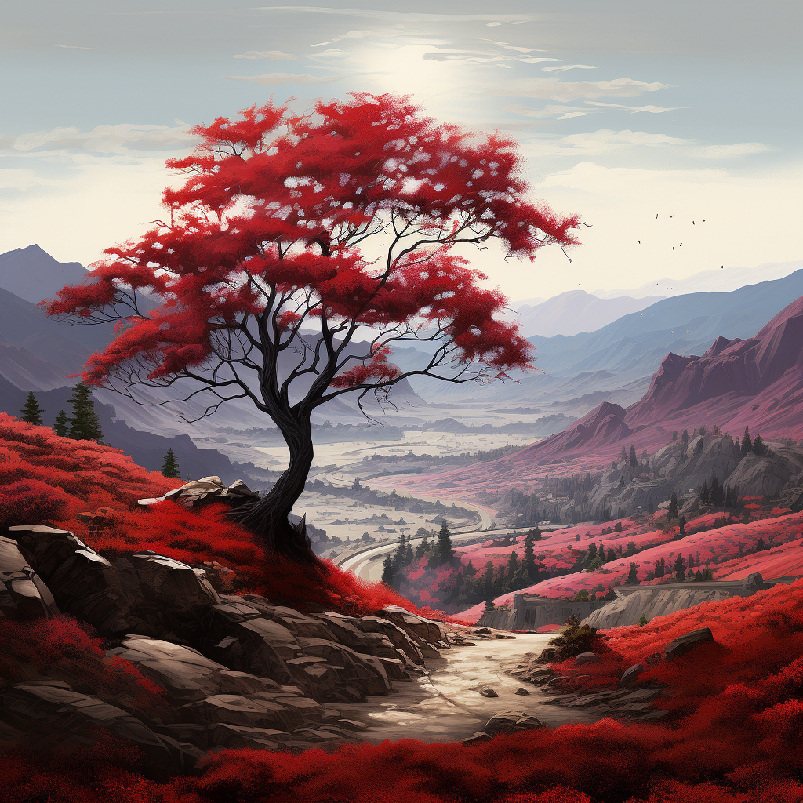

AI image generation is a rapidly evolving field that offers a novel way to produce images. This rule discusses different AI image generators and what we can use AI images for.

<!--endintro-->

## Prompting basics

Prompts are the instructions that you input. They can be as simple or as complex as you like. A general prompt might look like "generate an image of a sunset over the ocean," which tells the AI exactly what you're looking for. A well-structured prompt often has the format “A {{ TYPE OF PICTURE }} of a {{ MAIN SUBJECT }}, {{ STYLE CUES }}”.

::: greybox
“A brown dog on a skateboard”
:::
::: good  
Figure: Good example - A basic prompt
:::

You can add more detail to make a more effective prompt by following this template:

::: greybox
**{{ ADJECTIVE }}, {{ EMOTION }}, {{ SUBJECT }}, {{ STYLE }}, {{ COLOR }}**
:::

## Negative Prompting

Negative prompting is specifying what you don't want in your image. It can be an effective way of guiding the AI away from certain features that you're not interested in. Some AI image generators (e.g. Midjourney and Dreamstudio) have this option. In others (e.g. DALLE-2), you can include it in your prompt.

::: greybox
“An open highway --no cars”
:::

::: good  
Figure: Good example - A prompt with a negative element in Midjourney format
:::

## Parameters

Parameters allow you to control different aspects of the generated image via settings on the image generator. Most AI image generators have parameter options, and they can significantly affect the result.

* **Resolution:** This defines the quality of the generated image. Higher resolution values will result in higher-quality images.

* **Randomness:** This parameter influences the amount of random variation in the generated image. Higher randomness values may result in more unique or creative images, but they can also lead to images that deviate more from the initial prompt.

* **Aspect Ratio:** Aspect ratio dictates the proportions of the image. For instance, you might choose a square (1:1) aspect ratio for social media posts, a landscape (16:9) ratio for video thumbnails, or a portrait (3:4) ratio for smartphone screens.

* **Style:** Style refers to specifying a particular visual style for the image. This could be a certain artistic style (like "impressionistic" or "cubist"). The AI uses this information to guide the stylistic aspects of image generation.

* **Uploading:** Most AI image generators allow you to upload an existing image so that the AI will create different variations of it.

::: greybox
"A scene"
:::

::: bad  
Figure: Bad example - A vague prompt like this gives an ambiguous image
:::

::: greybox
"A snowy mountain landscape at sunset... majestic peaks adorned with glistening snow, bathed in warm hues, creating an ethereal and serene atmosphere. The scene evokes awe as untouched slopes and frozen trees blend with the fading light, leaving an indelible impression of nature's grandeur. Two travelers cross a footbridge over a small creek in the foreground."
:::

::: bad  
Figure: Bad example - This prompt is too long
:::

::: greybox
"A snowy mountain landscape at sunset with warm hues"
:::

::: good  
Figure: Good example - A detailed description will provide the AI with specific elements to incorporate, resulting in a more accurate image
:::

## Recommended Tools

As of now, the top contenders are DALL-E 2, Midjourney, and DreamStudio. Each of these has features that make them stand out.  

### DALL-E 2

[DALL-E](https://openai.com/dall-e-2) is an AI system capable of creating realistic images from a natural language description.

* Uses a credit system where users purchase credits to use the model
* Some OpenAI users start with free credits

::: img-large  

:::

### Midjourney

[Midjourney](https://www.midjourney.com/home/) is used on Discord, where users interact with the bot by typing /imagine.

**Note:** A [Discord](https://discord.com/) account is required first.

* Cost: $8USD/month

* Images can be reiterated on

* Many parameters: [Midjourney Parameter List](https://docs.midjourney.com/docs/parameter-list) e.g. “--aspect”

* Prompting in Midjourney:

  * Even short prompts can produce beautiful images

  * Basic - /imagine cat

  * Specify an artistic medium – /imagine {{{ ANY ART STYLE }} style cat

  * Get specific – /imagine {{ STYLE }} sketch of a cat

  * Time travel – /imagine {{ DECADE }} cat illustration

  * Emote – /imagine {{ EMOTION }} cat

  * Be colorful – /imagine {{ COLOR WORD }} colored cat

  * Explore environments – /imagine {{ LOCATION }} cat

::: img-large  

:::

### DreamStudio

DreamStudio is made by StabilityAI and is used, like DALLE2, on a web interface. It is based on the Stable Diffusion model of image generation.

You can use the demo here for free [Stable Diffusion Web](https://stablediffusionweb.com/#demo), or you can use it through the [DreamStudio](https://beta.dreamstudio.ai/dream) interface (starting with a free trial).

* You can use the web demo without signing up
* Distinguishable because of the easy customization of parameters (e.g., style, aspect ratio) on the interface

::: img-large

:::

## ✅ Where should you use AI-generated images?

* **Content Creation:** AI-generated images can be used for content creation in blogs, websites, magazines, and social media posts. They can help fill gaps where stock images or professional photography might be expensive or unavailable.

* **Ideation:** Artists and designers can use AI to generate concept art or design ideas, helping them visualize and brainstorm more effectively.

* **Education:** In an educational context, AI can be used to create images that help illustrate complex concepts.

* **Communication:** In an increasingly digital world, AI-generated images are a fun and interesting way to supplement your communications. Communicating with friends and colleagues is a great opportunity to experiment.

## Videos

`youtube: https://www.youtube.com/embed/nYqeHIRKboM`
**Video: Midjourney 5 must be stopped at all costs (3 min)**

`youtube: https://www.youtube.com/embed/zf4z8A-OWBY`
**Video: How To Generate INSANE AI Art For Beginners (2 min)**

`youtube: https://www.youtube.com/embed/Ng_GmJy_F8c`
**Video: Advanced Midjourney V5.1 Guide (11 min)**
