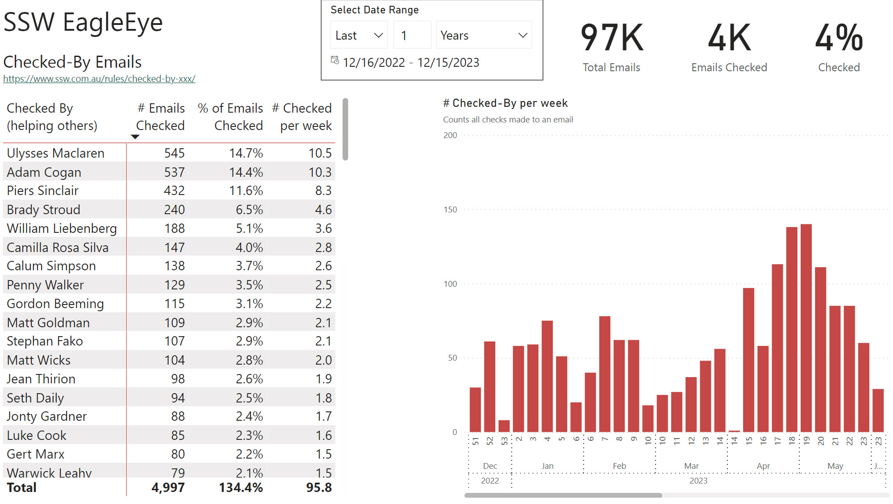

The emails exchanged within your company are more than just communication tools; they are a rich source of data. By analyzing this data, we can gain insights into various aspects of our business operations.

<!--endintro-->

At SSW, we follow a set of [email rules](www.ssw.com.au/rules/rules-to-better-email/) that ensure our emails are consistent and structured. This consistency is crucial for effective data analysis, as it standardizes the format and content of the emails, making them easier to parse and understand.  

With **Microsoft Graph API** we are able to extract Outlook data. The extracted data is not just collected; it is transformed into actionable insights through Power BI reports. These reports provide a visual representation of the data, making it easier to interpret and use for strategic decision-making.

::: good
Figure: Good example - Visual representation in Power BI highlighting the insights from the rule [Do you use 'Checked by xxx'?](https://www.ssw.com.au/rules/checked-by-xxx/)
:::