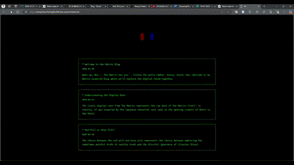

Traditionally, UI wireframes have been made with tools like Figma, Excalidraw, Balsamiq, or pen and paper. Generative AI tools now streamline the process. We can use Prompt Engineering to create a Proof of Concept (PoC) or translate a design to code with the click of a button!

<!--endintro-->

`youtube: https://www.youtube.com/watch?v=cyFVtaLy-bA`
**Video: Build a fullstack app in 7 minutes with v0 (Figma to code)! (7 min)**

Here is a longer example of someone using v0.dev to generate a calculator UI and then trying to replicate the same UI by hand: [V0 coded a calculator 30x faster than me (17 min)](https://youtu.be/WFZ-g0w3OW4?si=A-18DvJRd2KXfbNy)

## Boilerplate

When a web developer is handed design images, it can be a drag to spend the next few hours (or days/weeks) building the baseline components, HTML, and CSS before getting to the fun stuff.

Thankfully, AI-assisted tools are beginning to help with the more mundane aspects of this process, and sites such as [v0.dev](https://v0.dev) can produce React components (with the code) you can drop into your project to give you a huge head start on the work!

Upload your designers' images and tweak the output with a few prompts to get ready-made components for your app. Just be careful - these tools will often take "creative liberties" with the designs, so keep an eye out.

## Proof of concepts

Generative UI tools can be a great way to collaborate with stakeholders in realtime, as you can generate ideas and iterate over them using natural language prompts. This can give developers or designers a useful starting point and frame of reference to build a highly polished design.

If you're a dev that likes (or is forced) to moonlight as a designer these tools can be a great timesaver in creating professional looking web components in a short amount of time. These tools aren't a substitute for a layout created by a qualified designer but they can be great for generating boilerplate code or proof of concept designs that you can build on in the future.

### Example

Here is what you can achieve using [v0.dev](https://v0.dev) and a few prompts:

::: greybox
🤖 AI prompts excamples:

1. Create a form to input customer data like: first name, last name, DoB, email, phone, etc..
2. Do it using material style component. With a primary color red
3. Use this red instead : #CC4141, and add icons next to labels, like a phone icon next to the phone number, etc

:::

### Tools

* [v0.dev](https://v0.dev)
* builder.io

  * [Generate Figma Designs with AI](https://www.builder.io/blog/ai-figma)
  * [Design to Code](https://www.builder.io/m/design-to-code)
* [UIMagic](https://www.uimagic.io/) (waitlist)
* [Pineapple Builder](https://www.pineapplebuilder.com/)
