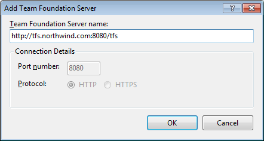

Getting someone else to test the migration is the best way to make sure that you have not missed anything.

<!--endintro-->

1. Run [SSW Diagnostics](https://www.ssw.com.au/ssw/Diagnostics/Default.aspx), check it’s all green ticks
2. Diagnostics will pick up that you need the Visual Studio 2008 SP1 Forward Compatibility Update for Team Foundation Server 2010 installed
3. Start Visual Studio 2008
4. Open Team Explorer
5. Add a new server. E.g. tfs.northwind.com:8080/tfs/

  

6. Confirm that the following are correct
    1. Source Code - connect to TFS2010 server and confirm that you can get latest.
    2. Source Code history - check that the source history is intact
    3. Work Items - confirm that you can see the last work items that you created
    4. Team Project - Create a new team project and check the SharePoint portal and reports work

**Note:** This will need to be done using Team Explorer 2010 as it is not supported in 2008.

### Congratulations, you’ve done a successful migration
