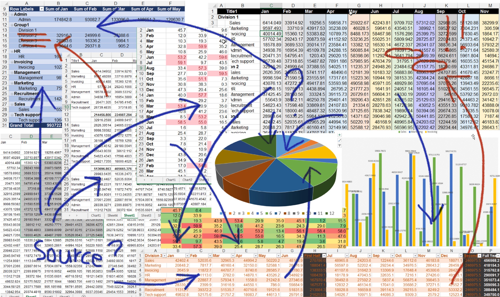
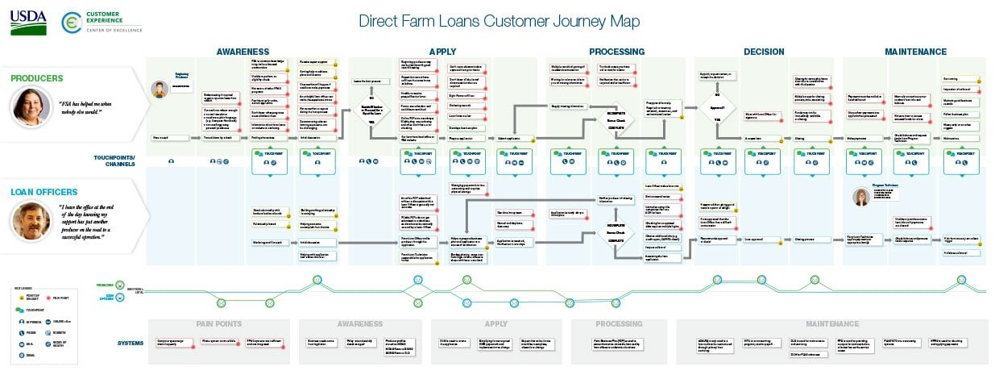

Getting accurate information from a client during a Spec Review ensures that the full scope of the project is captured and there are no surprises later on. Accurately refining the product avoids waste. 

<!--endintro-->

Here are some tips that should help focus in on a feature. 

### Tip 1: Check if the Product Owner can explain and show their process

Look at how they perform the task manually and listen to them  explain the process.  

### Tip 2: Draw a Mock-up or process flow diagram as you listen to the requirements

Creating mockups or diagrams of the feature will be highly beneficial as the client can see the feature visually. 

### Tip 3: Consider a Prototype

Consider building a functional prototype (works, but throw away code).

### Tip 4: Record Specification Reviews 

Recording the Specification Review is another great way to make the information as clear as possible. Being able to look back and clearly lookup what was mentioned, saves re-asking questions. 

### Tip 5: Consider a Journey Map

Journey Maps help to highlight which person is responsible for decisions at various stages. 

E.g. On this Journey Map observe the experience for the Producer and the Loan Officer. See how they move through the steps of obtaining and maintaining a farm loan. 

  > The map highlights the emotional journey as described by these customers, including their points of pain and delight. In addition, you’ll find the technologies, systems, and touchpoint types used through the process.  
  From [USDA Direct Farm Loans Journey](https://coe.gsa.gov/coe/farm-loans/index.html#journeymap)
  

See the [high-res version PDF](Direct-Farm-Loans-Journey-Map.pdf).

### Tip 6: Does the client know why you need to understand?

> “I am not a code monkey. I solve business problems with code. I need to understand that problem to do that well.”  
  From [Bryan Finster](https://www.linkedin.com/posts/reneschulte_developer-softwareengineering-engineering-activity-6922838921693294592-pNRg/)
