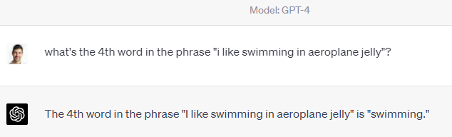
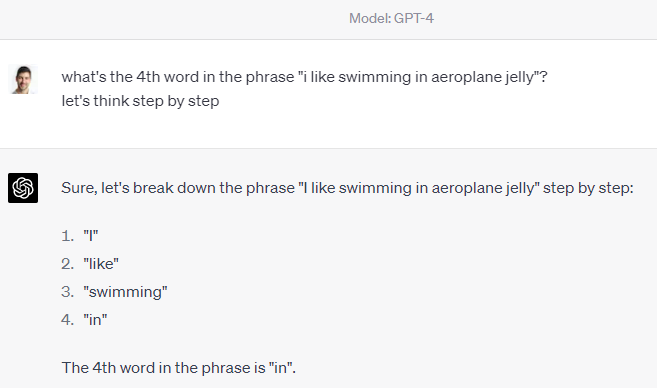

By getting ChatGPT to think through its answers step by step, you can receive more logical and coherent responses that break down complex topics or tasks into easily understandable components. This is especially useful for mathematical questions.

<!--endintro-->

Request that ChatGPT thinks through its answer with you. It's similar to telling a maths student to "show their working".

* Add the magic phrase "Let's think step by step"
* This is known as Zero shot chain of thought prompting
* If you're unsure about a ChatGPT correction, ask "I'm not sure if XYZ is right? Can you explain it to me?". It might correct itself if it's wrong
* Ask "Why do you believe that?", "Can you explain why do you think that?", "Can you give me steps on how you got here?", etc. to get an explanation for the AI's reasoning

