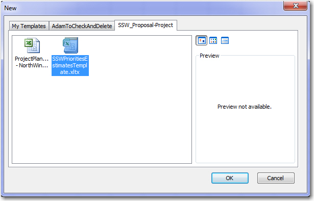
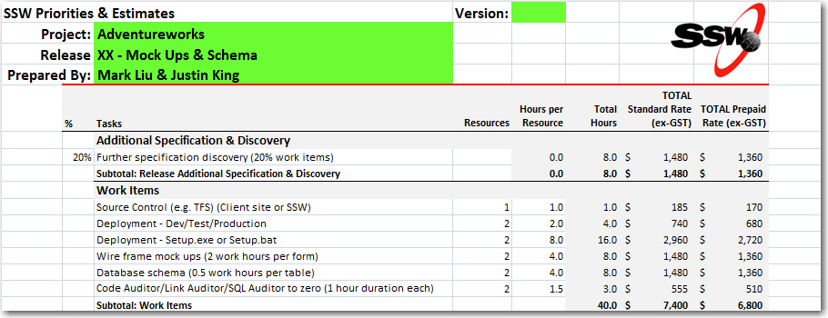
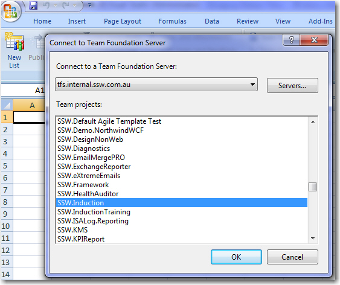
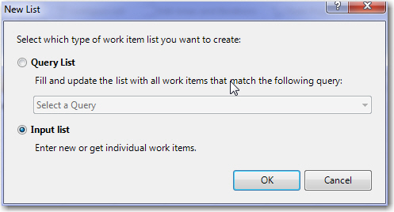
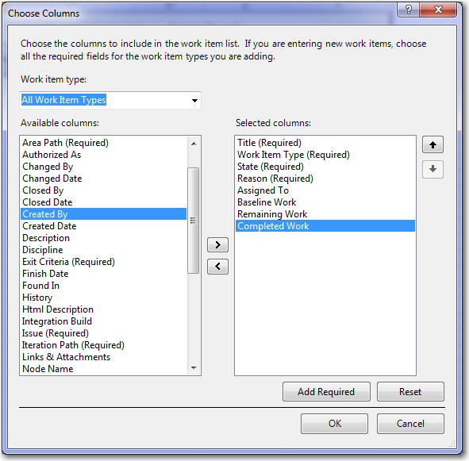
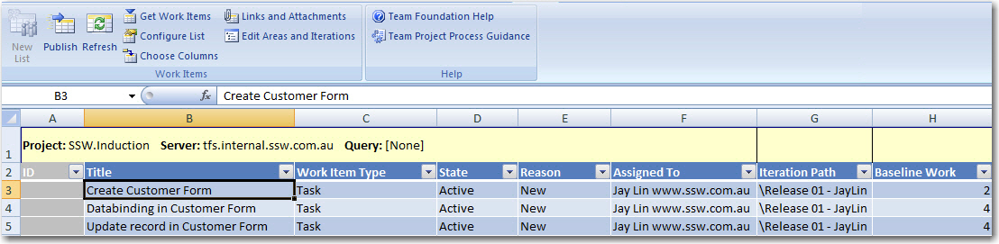

Initializing the Project - See how to get the work items into Azure DevOps via Excel:

<!--endintro-->

* Open SSW Priorities Estimate Template in Excel
  

* Add the tasks and additional tasks into Release_XX sheet
  

**Note:** The Project Management tasks will be calculated based on your tasks

* Create a new sheet and go to Team tab
* Click "New List" and choose your project
  

  
  
* Add the other useful columns e.g. Baseline Work, Remaining Work, Completed Work into Excel
  

  
  
* Copy work items (including the Project Management tasks) from Release_XX to the new sheet
  

* Click "Publish" button to upload the work items to TFS