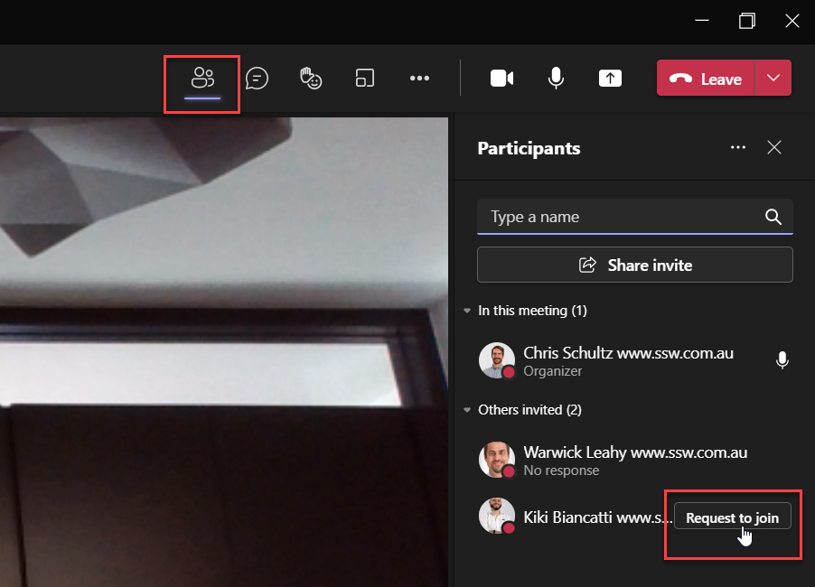

It can be difficult to get everybody into a meeting, especially these days when many meetings are online. It is important that time is not wasted in these situations, so it's good to be proactive and have a plan for when the decision maker is busy.

<!--endintro-->

### Make it a ceremony

You have already [shared the agenda](/share-the-agenda), so pick out the best item and ping the decision maker before the meeting: 
> "We're meeting in 30 minutes, I'm excited to be talking about xxx"

### Be persistent

If the meeting should have started and the decision maker has not joined, then add them to the call, ping them again, or call them. If you don't get a response, tell them *"I will call you towards the end of the meeting for a summary"*, as per [Do you know how to loop someone in at the end of a meeting?](/loop-someone-in)

Once you have done the above, you can start the meeting without the decision-maker. You may choose to start with the less important items in the agenda, or the ones that won't require a final decision ("For information" items) that can be easily summarised at the end of the meeting.

