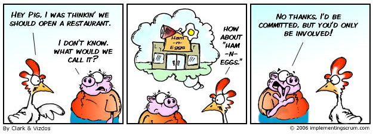

Everyone who will be involved in Scrum (pigs and chickens alike) should have read and understood the Scrum guide. 

<!--endintro-->

Understanding the concepts of Scrum is easy; implementing it is hard!

 

Everyone should:

1. Read the [Scrum Guide](http://www.scrumguides.org/).
2. Take the [Scrum Open assessment](http://www.scrum.org/scrumopen/) and get at least 75% to be “Certified Scrum 1”
3. Watch the awesome video: '[Scrum in 10 minutes](https://youtu.be/XU0llRltyFM)'

`youtube: https://youtu.be/XU0llRltyFM`
