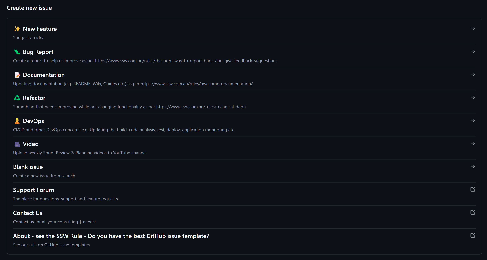

GitHub Issues offer a great way of raising Issues within projects. However, it can be difficult to distinguish whether the Issue is a bug, feature request or just a question.  
GitHub Issue Templates should be used to help standardize Issues and ensure they have enough information for a developer to start work.

Let's take a look at how implementing Issue Templates can improve repository backlogs...

<!--endintro-->

::: bad

:::

::: good 

:::

::: good 

:::

::: info
For instructions on setting this up:
- See [Configuring Issue Templates for your repository](https://docs.github.com/en/communities/using-templates-to-encourage-useful-issues-and-pull-requests/configuring-issue-templates-for-your-repository) 
- Check out our Template - [SSW Github repo Template.](https://github.com/SSWConsulting/SSW.GitHub.Template)
:::
