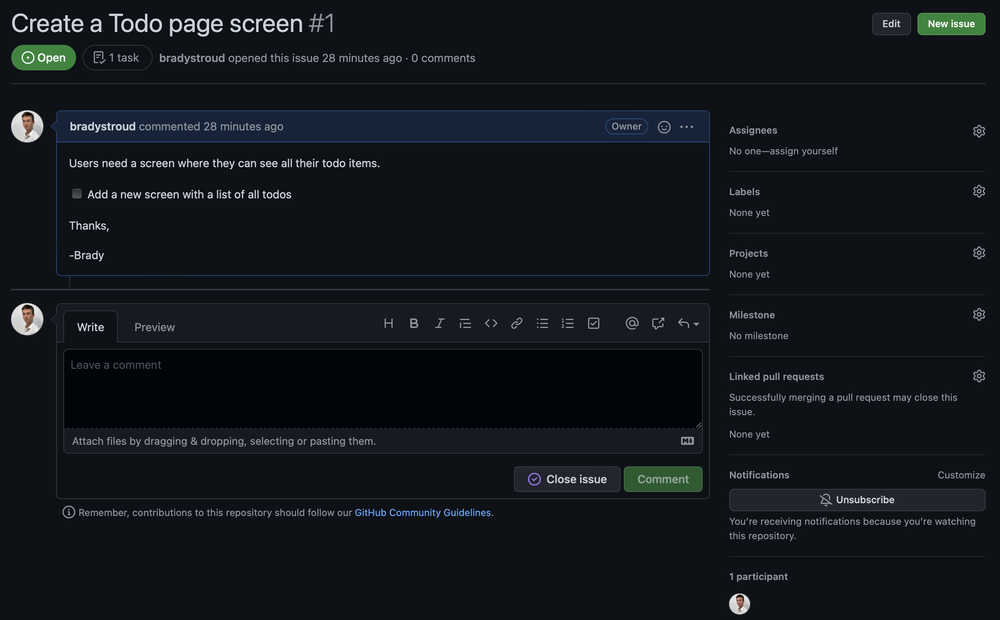

GitHub issues offer a great way of raising issues within projects. However, it can be difficult to distinguish whether the issue is a bug, feature request or just a question.
GitHub issue templates should be used to help standardize issues and ensure they have enough information for a developer to start work.

<!--endintro-->

::: bad

:::

::: good 

:::

::: good 

:::

For instructions on setting this up, see [Configuring issue templates for your repository](https://docs.github.com/en/communities/using-templates-to-encourage-useful-issues-and-pull-requests/configuring-issue-templates-for-your-repository) or check out our template - [SSW Github repo template.](https://github.com/SSWConsulting/SSW.GitHub.Template)
