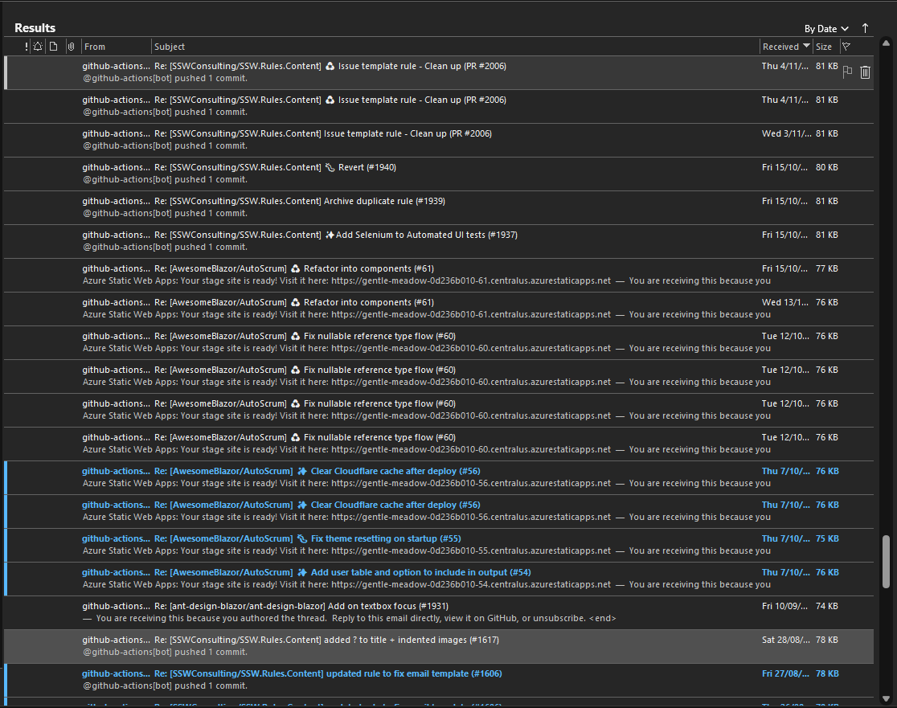

Notifications from GitHub can be quite a pain, as they send a lot of emails. This leads to many developers ignoring the important emails they receive.

`youtube: https://www.youtube.com/embed/Lb1slP9jSGk`

<!--endintro-->

::: bad

:::

To reduce this spam and to make the notifications have value, make sure to configure your [GitHub Notifications](https://github.com/settings/notifications).  

::: good

:::

The important one here is to make sure the item marked **Send notifications for failed workflows only** is checked, so that you receive emails for failures in your deployments.
