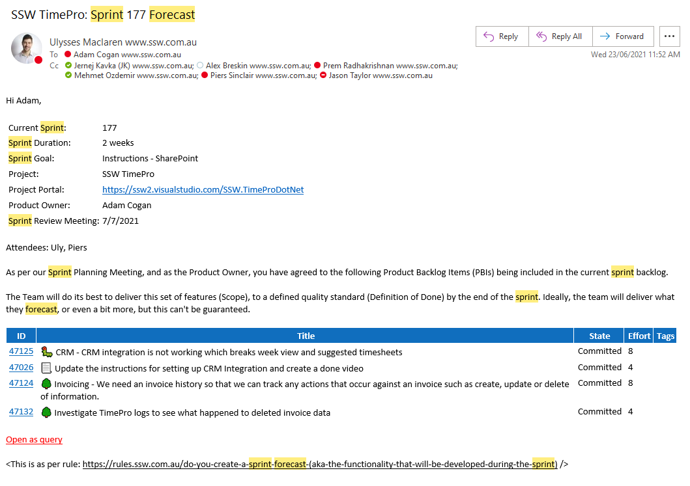
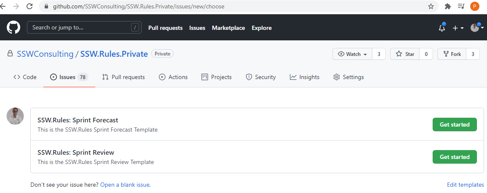
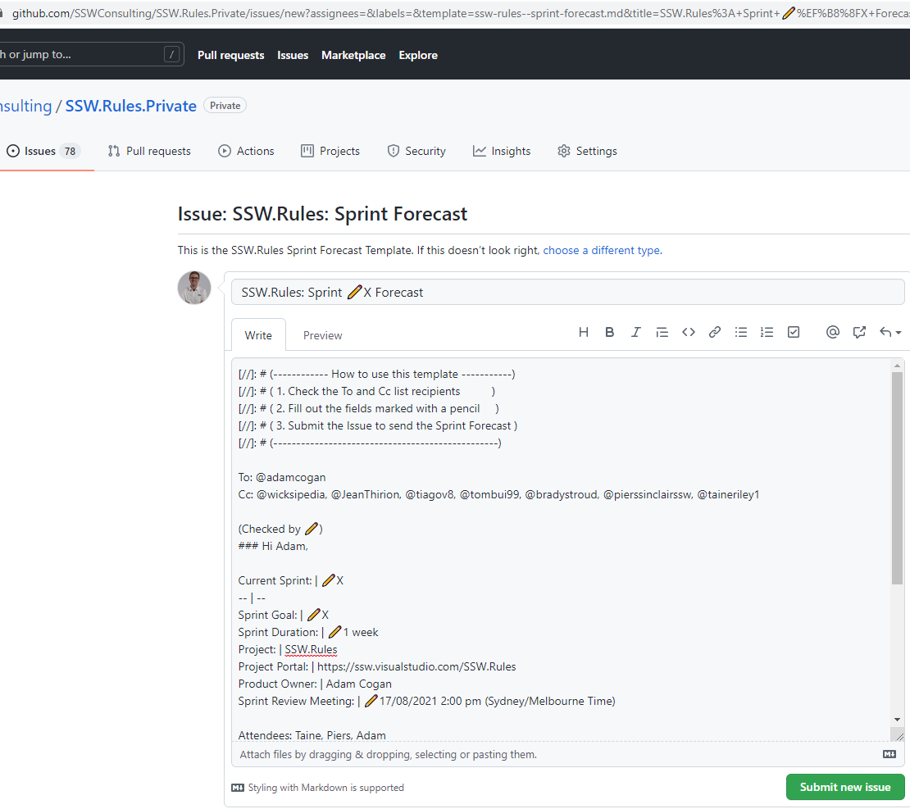

Sprint emails can be painful because you need to copy and paste data. Moreover, you can easily lose visibility of all your past sprints.

GitHub issue templates help solve this problem by standardizing the format and location of sprints. 

Let's take a look at how...

<!--endintro-->

Creating an issue template for both your Sprint Review/Retro email and your Sprint Forecast email gives you several advantages.

* Users don't need to copy and paste the template, they simply press "new" and are prompted for information.
* Visibility of all past sprints is shown in the GitHub issue history
* Let's you edit with markdown
* Standardizes the Sprint Forecast and Retro/Review process and information included
* You still get an automated email from GitHub, so you don't lose anything by making the switch!

Make your GitHub issue templates follow the format of the rules on [Sprint Forecasts](do-you-create-a-sprint-forecast-aka-the-functionality-that-will-be-developed-during-the-sprint) and [Sprint Reviews](do-you-create-a-sprint-review-retro-email) then you are good to go. 

Give your Sprint issues a special "sprint" tag so they can be identified in the backlog. Alternatively, you could store them in a separate repo which keeps them apart from your others issues and lets you keep the sprint emails private if you don't want them in your public repo.

::: bad

:::

::: good

:::

::: good

:::
