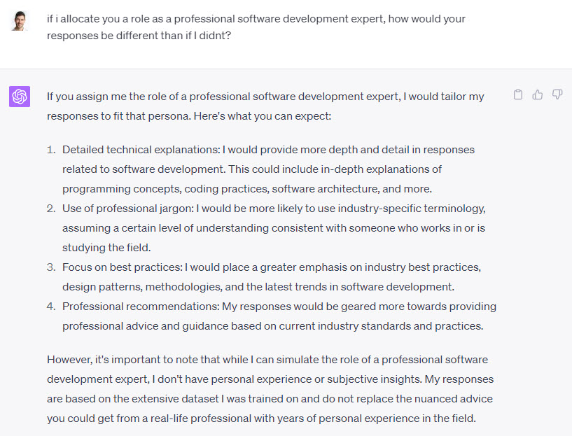

Assigning a specific role to ChatGPT can help guide the model's responses and ensure they align with the desired expertise or perspective. By providing a clear role, you can focus the generated output on the specific knowledge area or viewpoint you require.

<!--endintro-->

Here are some tips for assigning roles to ChatGPT:

* Be explicit about the role you want ChatGPT to assume in your prompt
* Ensure the role is relevant to your question or request
* Consider the level of expertise or perspective needed for your desired response

::: greybox 

1. "As a personal finance expert, explain how to create a monthly budget that prioritizes debt repayment and long-term savings goals."
2. "As a nutritionist, provide a one-week meal plan for a vegetarian athlete that balances macronutrients for optimal performance."
3. "As a career counselor, suggest five steps for a recent graduate to take when seeking their first job in a competitive market."
4. "As a time management consultant, provide three techniques for improving focus and productivity while working from home."
5. "As a language tutor, offer five creative ways to practice conversational skills in a foreign language without traveling."
6. "As a cybersecurity expert, detail the top five measures individuals should take to protect their personal data online."
7. "As an interior designer, propose a plan to maximize space and storage in a small city apartment, while maintaining a comfortable living environment."
8. "As a parenting coach, share three effective strategies for promoting healthy screen-time habits in young children."
9. "As a mental health professional, provide a list of self-care activities for individuals experiencing stress and burnout in the workplace."
10. "As a fitness trainer, develop a 30-minute, full-body workout routine that can be performed at home without specialized equipment."
11. "As a travel advisor, recommend a 10-day itinerary for a culturally immersive and environmentally conscious trip to Japan."
12. "As a sustainability expert, suggest five actionable steps a household can take to reduce their carbon footprint."
13. "As a sleep specialist, provide recommendations for improving sleep quality and establishing a consistent sleep schedule."
14. "As a relationship therapist, outline three communication exercises for couples looking to strengthen their emotional connection."
15. "As a recipe developer, create a delicious and healthy three-course meal using only locally sourced, seasonal ingredients."
16. "As a dog trainer, share five essential commands every dog owner should teach their pet for obedience and safety."
17. "As a professional organizer, describe a step-by-step process for decluttering and reorganizing a home office."
18. "As an event planner, provide a timeline for organizing a memorable and budget-friendly destination wedding."
19. "As a gardening expert, explain how to create a thriving, low-maintenance container garden on a small balcony or patio."
20. "As a personal stylist, demonstrate how to build a versatile and timeless capsule wardrobe with just 20 key pieces."

:::

::: good
Figure: Good examples - Giving ChatGPT the role of the expert that could help you most
:::

By assigning a specific role to ChatGPT, you can guide the model's responses to better address your needs and provide information or assistance tailored to the desired expertise or perspective."

### "Act as" vs "You are"

All the examples above are effectively "you are..."

When assigning a role to ChatGPT, both "Act as..." and "You are..." can work effectively, but they may yield slightly different results. It's essential to consider the context and the desired outcome when choosing the best approach.

"Act as...": This phrasing suggests that ChatGPT should pretend to be the specified role or character. It can yield more playful or creative responses, as the model might lean towards the idea of "acting" rather than genuinely being the character or expert.

::: greybox 

"Act as a historian and explain the causes of the French Revolution."

:::

"You are...": This phrasing is more direct and instructs ChatGPT to take on the specified role or character more seriously. It can result in more focused and accurate responses, as the model assumes the identity of the specified role or expert.

::: greybox 

"You are a historian. Explain the causes of the French Revolution."

:::

To find the best approach for your specific needs, it's a good idea to experiment with both phrasings and analyze the results. Each may work better in different contexts or for different types of questions, so trying both can help you determine which one is most effective for your particular use case.