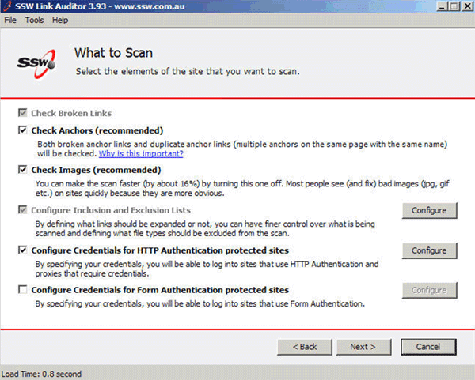

Put in all information, even if some aren't selectable, provided there is context.

<!--endintro-->

This lets the users see what is available and what isn't, without being overbearing.
<dl class="goodImage">&lt;dt&gt;&lt;/dt&gt;
<dd>Figure: Good Example - The "Check broken links" checkbox in this case is not an option, but showing it gives the user context</dd></dl>
