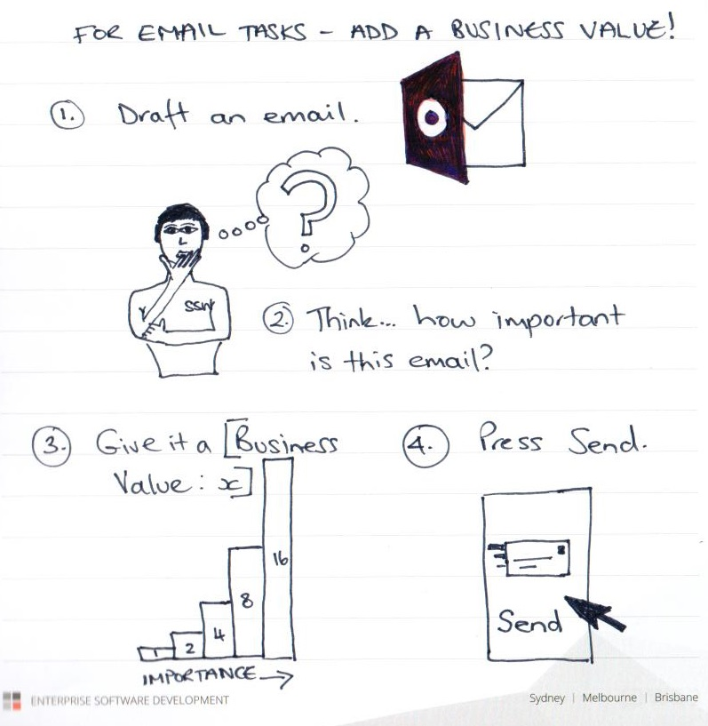

The problem with emailing a task, is that no one knows how important that email is, in relation to all their other emails. So, what is the solution?

<!--endintro-->

People can send tasks in different ways:

1. Send a simple email with no priority indication

::: bad

:::

2. Put the task straight into the backlog in the desired priority order, but send no email

::: bad

:::

3. Send an email indicating its priority. The recipient reviews it and places it into the backlog, based off the specified Business Value

::: good

:::

## The perfect email workflow

Before you email a task to someone, think about how important it is to you. Then draft your email, add the Business Value using the same scale that you would use to estimate your PBIs.

::: good

:::

## What if you need to write an email to multiple recipients?

Assign each person a Business Value. In the case of "To Myself" emails, you can also add the amount of 'Effort' required too.

::: good

:::
