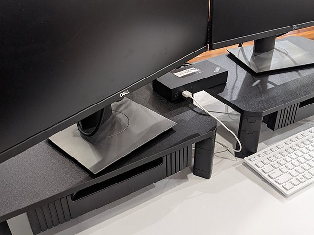

Communication can be difficult (even if English is your first language!). It might be tempting to only communicate via text in IM, but this will not improve your skills or build a relationship as well as communicating verbally.

::: good

:::

### Tips to have a better call

<!--endintro-->

Try to always answer the call with video (if weak bandwidth, use it for the first 10 seconds and say "I'll turn off video to save bandwidth").

**Sound** 

* Be ready with the headset already on (it looks disorganized plugging it in after you make the call)
* Check the sound quality of the microphone - you need a good mic and it should be close to your mouth - if you are using the laptop mic, sit in close.

**Video** 

* Check the image quality of the camera. 
* Beware of the angle of the camera - the ones with thin bezels now put the camera at the base, looking up your nose. Avoid them. Frame your head and shoulders in the shot, and keep the camera lens at or above **eye level** - [use a stand if necessary](https://www.dicksmith.com.au/da/buy/kogan-height-adjustable-laptop-monitor-stand-kogan)

* Consider what is in the background.
* Keep a light source on your face, and try to avoid sitting with a window behind you.
* Have a microfiber cloth and wipe off the lens from time to time.
* Get your video background right. Read [Rules to Better Branding](/rules-to-better-branding)  

::: bad

:::

::: good

:::

**Text** 

* It's always helpful to confirm things you're talking about with typed text during the call (Especially helpful for people with English as a second language).

For more info see [How to look and sound great online](https://www.cnet.com/how-to/ultimate-webcam-tips-how-to-look-sound-great-online/)

::: greybox
**Tip:** Help the other person with following this rule by taking a screenshot and giving them a mark /10 with good and bad feedback on the call quality and background.
:::