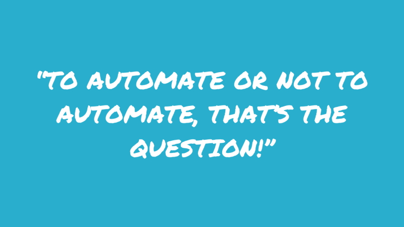

Automation can be an awesome part of a test strategy, but not all tests are good candidates to be automated.

[Not all testing can be completely automated](https://www.ssw.com.au/rules/why-testing-cannot-be-completely-automated), due to the uniquely human skills that are required (e.g. exploration, learning, experimentation). But even for those tests that _can_ be automated, not all of them _should_ be.

Let's look at how to decide whether a test is a good candidate to be handed over to the machines.

<!--endintro-->

> If you try to "automate" bad testing, you’ll find yourself doing bad testing faster and worse than you've ever done it before.
>        - Michael Bolton

### ✅ Do: Good candidates for automation

When deciding what to automate, there are certain attributes that make a test a good candidate to implement via automated means.

#### Unit tests

A solid foundation of reliable automated unit tests helps you to develop (and refactor) with more safety. Since unit tests are designed to be small in scope, they are fast to execute and so large numbers of unit tests can be run automatically as part of your CI/CD pipeline without introducing significant extra time to your build/deployment process. 

#### Repetitive tests that run for multiple builds

If you have particular types of tests that run across multiple builds, then they should be automated. The repetitious nature of such tests makes it worthwhile to spend the time to automate them. Regression and API tests are good examples.

#### Smoke tests and tests covering the most common user workflows

Smoke testing is designed to verify that the critical functionality of the software is working, at a very high level. Smoke tests can be useful right after a new build is made to decide whether or not you can run deeper (and more expensive) tests, or right after a deployment to make sure that the application is running properly in the newly deployed environment. 

Given the high value of smoke tests and their repetitious nature, they are generally great candidates for automation. You might additionally consider automating some tests to cover the most commonly-used user workflows, so that you receive fast feedback of any breaking changes to these important workflows.

#### Tests of many different configurations, options or data sets

There are good benefits to be had, both in terms of time to execute and coverage, in automating tests where many different configurations, product options or data sets need to be tested. For example, the same automated test can be used to verify a web application running across different browsers and/or devices.

#### Tests that are impractical or impossible for humans to perform

Some types of test are impractical or simply impossible for humans to perform. Examples of such tests include unit tests, and some types of performance and load tests where massive scale (e.g. simulating thousands of simultaneous users) is required. Automation should be leveraged in these cases to extend the capabilities of human testers.

### ❔ Maybe: Take care when deciding to automate these tests

It's not always a black and white decision about whether to automate a test or not and a few of these grey areas follow.

#### Automating "manual" test cases

Teams are often tempted to take their existing "manual" test cases and automate them, especially as a way to kick off an automated testing project. This isn't necessarily a good approach since the test cases were designed to be performed by humans and not all of their steps probably make sense to be automated, from a value perspective. 

It's important to review the intent of the test cases and then design appropriate automated tests to leverage the benefits of automating them while avoiding the waste of automating lower value tests.

#### Adding automated tests for every bug

It might seem like a good idea to have a policy of adding an automated test for every bug you fix, to help ensure the bug doesn't happen again. 

While this can be a valuable policy, you should leave room for exceptions to this rule. Some bugs are merely cosmetic and are unlikely to appear again. A good example of this is the typo - if a developer accidentally entered text that said "Contcat us" instead of "Contact us", it's very unlikely that a developer would ever go into the code and revert to the earlier misspelling.

### ❌ Don't: even think about automation for these tests

Some types of test just don't make sense to even try to automate:

* Tests for features that are in the early stages of development and whose behaviour is not yet stable
* Exploratory tests
* User experience tests for usability
* Tests that will only need to be run once
* Tests of obscure edge cases (that are not shown to be prevalent in usage data)

### Further reading

[When Should a Test Be Automated?](https://www.stickyminds.com/sites/default/files/article/file/2014/When%20Should%20a%20Test%20Be%20Automated.pdf) by Brian Marick
