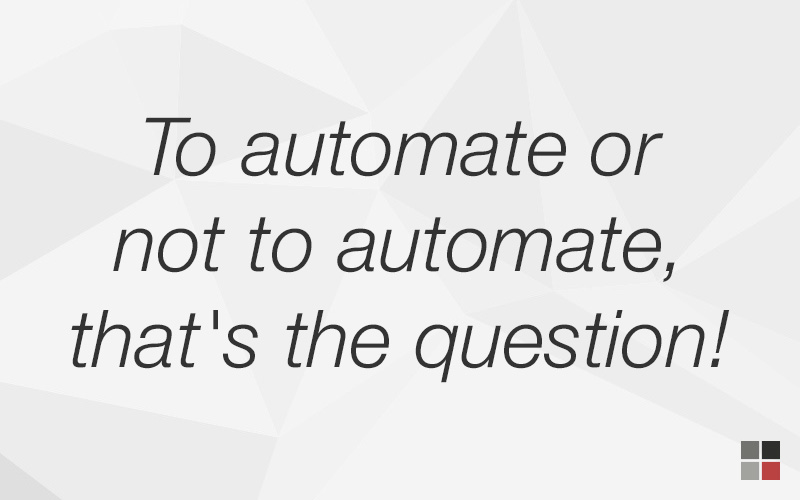

Automation can be an awesome part of a test strategy, but not all tests are good candidates to be automated.

[Not all testing can be completely automated](/why-testing-cannot-be-completely-automated), due to the uniquely human skills that are required (e.g. exploration, learning, experimentation). But even for those tests that **can** be automated, not all of them **should** be.

<!--endintro-->

> If you try to "automate" bad testing, you’ll find yourself doing bad testing faster and worse than you've ever done it before.  
>        - Michael Bolton

## Evaluating the value of automation 

There are multiple attributes that make a test a good candidate for automation. 

- **Repeatability** - How often is the test run?
- **Complexity** - How prone is the test to human error?
- **Time commitment** - How long do testers have to dedicate to completing a test?
- **Stability** - How likely is it that the test will change in the future?
- **Scale** - How much data needs to be run through the test?
- **Subjectivity** - How easy is it to evaluate the test outcome objectively?
- **Value** - How much value does the test provide?

`youtube: https://www.youtube.com/embed/pQPUs9uaKUM`
**Video: What is automated testing? Beginner intro & automation demo (watch from 5:30 – 7:10)**

### Repeatability
Consider how often a test is run. If it is run across multiple builds, or if the same test needs to be run on different data sets or browsers then it may be worth automating.

For example, if a test is run on Chrome, edge and firefox then automating it delivers more ROI since that is now 3 less tests the tester has to perform.

### Complexity
How easy is it for a human to test? If it requires many inputs where a human might make a mistake, then automating it could be a good idea.

For example, if there was a test for a calculator app and the tester had to enter 20 different inputs before pressing calculate, that would be a good reason to automate since there is a high chance of human error.

### Time commitment
Always weigh the time to perform a test against the time to automate it. The longer it takes for humans to perform a test, the higher the value in automating it.

For example, if a test takes 1 hour for testers to perform and automating it takes 2 hours, then after only a few runs the automation will have delivered ROI. However, if a test takes 1 minute to perform but 3 days to automate, then it won't deliver ROI for a long time after automation.

### Stability
Functionality that isn't well established or understood is risky to automate. This risk is because the test is liable to change as the requirements change.

For example, if the customer has asked for a new page and the V1 has been delivered, it isn't a good idea to automate the testing of that page just yet because customers and the client will likely have many change requests in the near future.

### Scale
Tests that are run on huge data sets are often impractical for humans to perform, and are often better automated.

For example, if a test needs to be run against 5,000 records then it should be automated.

### Subjectivity
Some tests are easy to judge objectively, such as the outcome of a maths equation. Those tests often work great when automated. Conversely, tests which require human judgment, such as UX, do not work well when automated.

For example, if the user needs to judge how nice the colours on a page look to the human eye, then it may not be a good idea to automate it because it's subjective.

### Value
The more value a test provides, the greater chance it is a good choice for automation.

For example, if a test checks whether the application is going to crash, and it has a high chance of failing then automating it would likely be a good idea since it will ensure it always runs correctly.

## ✅ Good candidates for automation

- **Unit tests** - Unit tests are often highly objective tests and so are a great first step into automation

- **Smoke tests** - Smoke tests do not require much human input and are repetitive and high value so it's usually a good idea to automate them

- **Regression and API tests** - These tests are highly repeatable and so are often good to automate

- **Performance and load tests** - Tests that look at performance and load often require a great deal of data or interaction making them impractical for humans to perform. As such, they are a good candidate for automation

## ❌ Don't even think about automation for these tests

Some types of test just don't make sense to even try to automate:

- **Tests that will only need to be run once** - For tests that won't be run again, it doesn't make sense to automate them.

- **Tests of early stage features** - These types of features are liable to change and shouldn't be automated.

- **Exploratory tests** - Experimentation is by it's nature unpredictable so it isn't a good idea to try and automate these tests.

- **User Experience tests** - UX is a very subjective matter, so it's not easy to automate these kinds of tests.

- **Tests for obscure edge cases** - Anything that tests obscure scenarios probably shouldn't be automated because it is unlikely to be a recurring problem.

## ❔ Take care when deciding to automate these tests

It's not always a black and white decision about whether to automate a test. Let's discuss:

- **Automating "manual" test cases** - Teams are often tempted to take their existing "manual" test cases and automate them, especially as a way to kick off an automated testing project. This isn't necessarily a good approach since the test cases were designed to be performed by humans and not all of their steps probably make sense to be automated, from a value perspective. 

- **Adding automated tests for every bug** - It might seem like a good idea to have a policy of adding an automated test for every bug you fix, to help ensure the bug doesn't happen again. 

   While this can be a valuable policy, you should leave room for exceptions to this rule. Some bugs are merely cosmetic and are unlikely to appear again. A good example of this is the typo - if a developer accidentally entered text that said "Contcat us" instead of "Contact us", it's very unlikely that a developer would ever go into the code and revert to the earlier misspelling.

### Practical examples

Let's look at some tests and why we would choose to automate them or not.

::: greybox
**Test Scenario:** Collapse the sidebar and check that the main pane resizes and displays correctly

**Reason:** This test is a bad candidate for automation because checking the UI requires a human judgment call, it isn't a precise objective call that a computer can make.
:::

::: bad
Bad example - Testing a Sidebar
:::

::: greybox
**Test Scenario:** during video playback, set the “Playback” speed to 1.25 and check that the audio is played faster than before but remains clear. 

**Reason:** In this case, the computer won't be able to easily judge whether the audio is clear or unclear.
:::
::: bad
Bad example - Testing video playback
:::

::: greybox
**Test Scenario:** Enter 100 into the amount field and check that the total invoice amount is updated to 110 (GST is added)

**Reason:** The test is a maths problem which is easy for a computer to evaluate.
:::
::: good
Good example - Testing a GST calculation
:::

::: greybox
**Test Scenario:** Enter “abcdefgh” into the editor, press the “Save” button and save with filename “test”. Close the editor. Open the file “test” and check that it contains “abcdefgh” only.

**Reason:** It's easy to evaluate the expected output with objective criteria.
:::
::: good
Good example - Testing a save button
:::

### Further reading

- [When Should a Test Be Automated?](https://www.stickyminds.com/sites/default/files/article/file/2014/When%20Should%20a%20Test%20Be%20Automated.pdf) by Brian Marick
