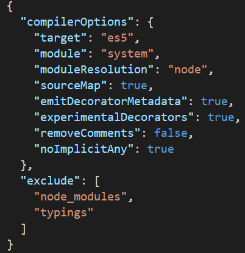
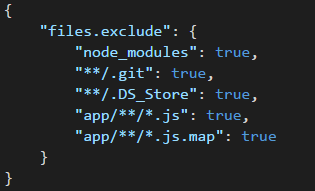

TypeScript is a powerful language that transpiles to JavaScript, and provides much desired type-safety and IDE refactoring support.  But without good configuration, a lot of the benefits can be lost.

 <excerpt class='endintro'></excerpt> 
<h3>Use tsconfig.json</h3>
Putting a “tsconfig.json” file in your project tells the typescript compiler where the root of your project is, and provides a centralized place to configure the compiler.  This config is read by IDEs and the compiler and can be utilised by the build scripts to ensure configuration is consistent.
<dl class="image"><dt>  </dt><dd>Figure: A tsconfig.json file with great configuration</dd></dl><h3>Disable implicit “any”</h3>
The primary benefit of TypeScript is type-safety, and attempting to escape from the type-safety should be a conscientious decision by the developer.  So ensure that noImplicitAny is true, and keep your code type-aware and able to be refactored.
<h3>Exclude external files</h3>
By default, the compiler will compile everything ending in .ts.  This means things inside node_modules and even typings will be parsed and included.  Ensure you exclude these files to reduce your compile time and, more importantly, reduce your reported errors. 
<h3>Don’t rely on TypeScript for bundling</h3>
TypeScript should compile in-place, and a single file input should produce a single file output.  This reduces compile time, and puts bundling in the hands of a system that knows more about the modules – the module loader. 

<h3>Hide generated files from your IDE</h3>
Files generated from typescript get in the way – you don’t want to scroll through .d.ts, .js and .js.map files all the time.  So hide them in the IDE. In VSCode this can be done via the “files.exclude” key in the settings.json file.  For a shared experience across the team, check this file into source control.
<dl class="image"><dt>  </dt><dd>Figure: VSCode settings.json file that hides generated files </dd></dl>

