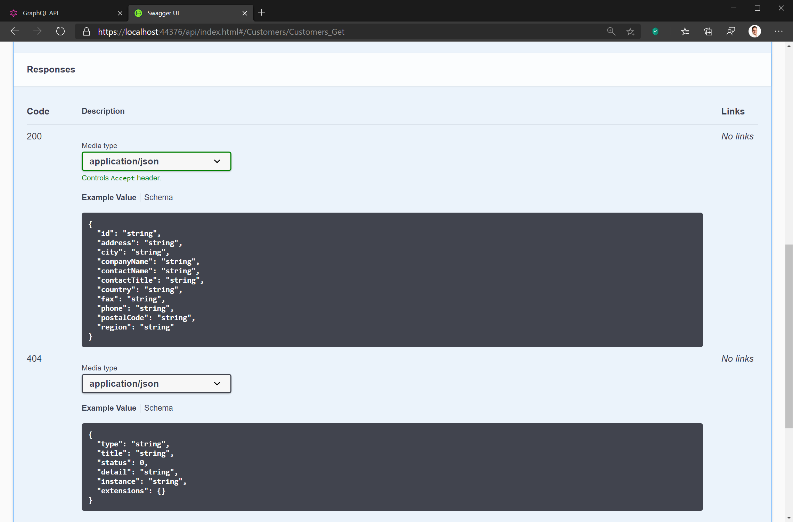
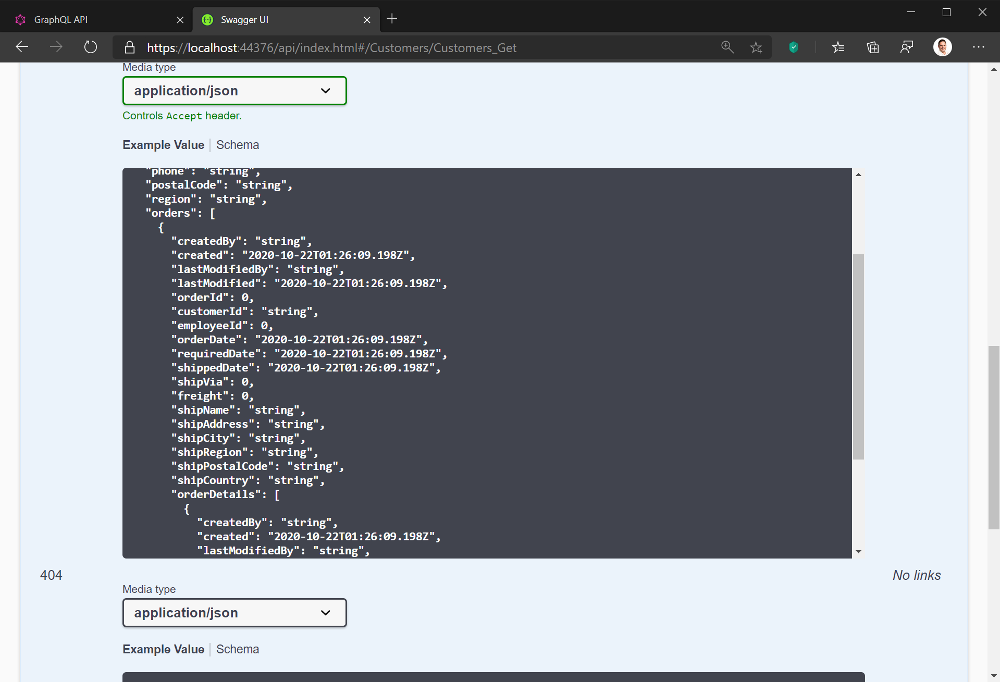
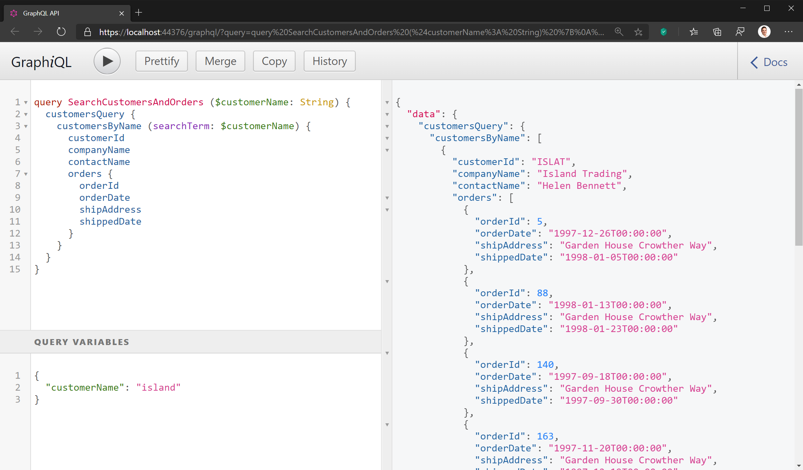
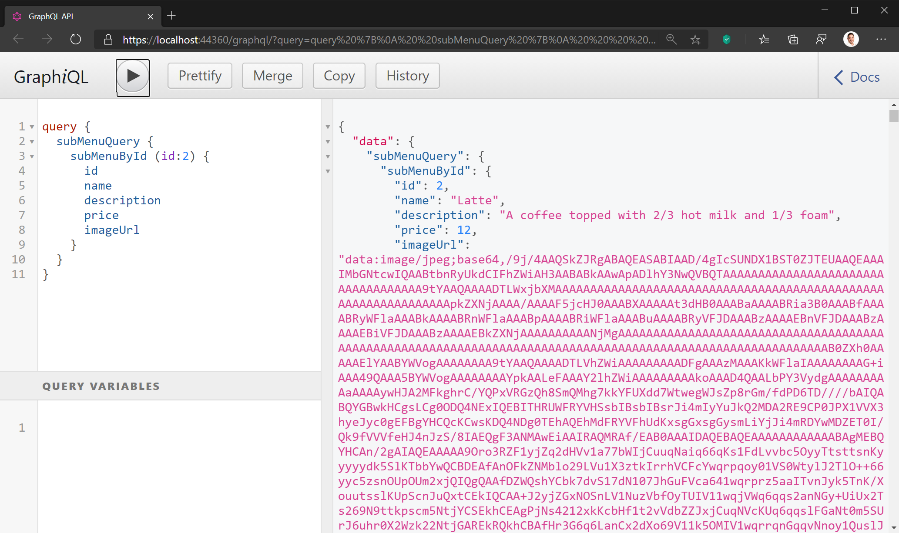
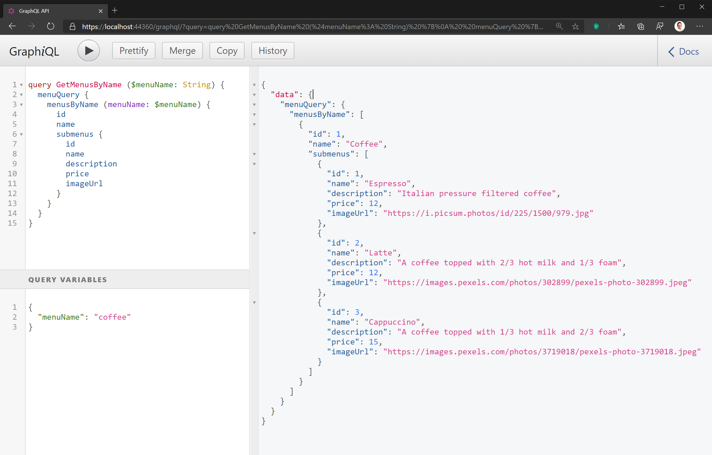
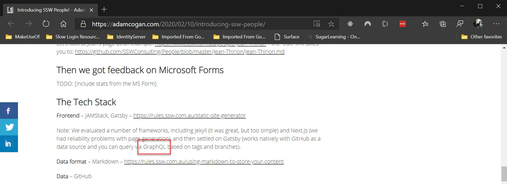
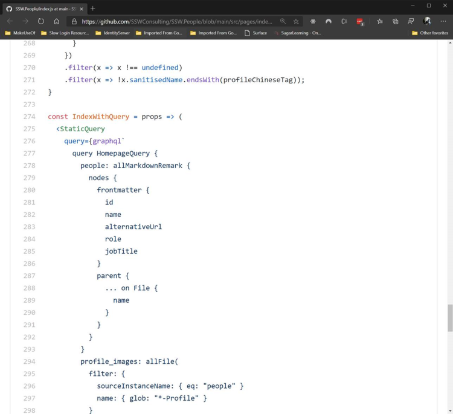

GraphQL is a query language for your APIs. It lets you expose a schema, which is a combination of **types**, **queries,** and **mutations** and your client applications can define their own queries based on that schema. You can think of it as SQL for the web.

GraphQL was developed by Facebook in 2012 to solve a problem with their mobile app, which was chewing users' data and battery and leading to negative reviews. This is because the Facebook newsfeed combines data from many entities and data sources, which required multiple API calls. GraphQL allowed them to retrieve all the data they need with 1 call.

<!--endintro-->

::: info
[Facebook open-sourced the GraphQL specification in 2015](http://spec.graphql.org/June2018).
:::

GraphQL is a query language; it is agnostic of database, programming language, OS, and platforms. To enable GraphQL, you can use client and server libraries (see Resourced below).

There are GraphQL server and client libraries for nearly all of these (see the Resources section below), which you can add to your existing projects to enable GraphQL.

### Key Terms

GraphQL differs from REST in that REST is concerned with **resources** and GraphQL is concerned with  **state** . While some features are somewhat analogous, it helps to be familiar with the GraphQL lingo and understand it in its own right. For more information, see ["Thinking in Graphs"](https://graphql.org/learn/thinking-in-graphs).

* **Types:** Types are the fundamental building blocks of your GraphQL API. Just like in a strongly typed language like C#, there are a default set of types, and you build your own by putting together default and custom types as **fields** of other types. See more on [graphql.org/learn/schema/#type-system](https://graphql.org/learn/schema/#type-system).
* **Queries:** GraphQL queries return the current state of the data source(s). Being a query language, you specify which fields you want the server to return – these can be any fields supported by the schema, including for related types. Your query is interpreted by the server and used to fetch data to pass back to the requesting client. One of the most powerful features of GraphQL is not just that it doesn’t care what the data source is, but  **schema stitching** allows you to aggregate data from multiple sources and return it to your client with one query. Those data sources could be different entities or database tables, different databases, or even flat files on a server, or other GraphQL (or REST) APIs. See more on [graphql.org/learn/queries](https://graphql.org/learn/queries).
* **Mutations:** Mutations change the state of the data source(s) that the GraphQL server exposes, similar to create, update, or delete operations. See more on [graphql.org/learn/queries/#mutations](https://graphql.org/learn/queries/#mutations).
* **Schema:** Your GraphQL schema is the complete map of data your GraphQL server exposes. This defines all the data that your clients can request, and all the changes they can make. Specific queries or mutations are not explicitly defined; rather, you specify their structure. Just like with a SQL database, you write whatever queries you want against it, and if the schema supports them, they will run successfully.

### Advantages of GraphQL

* **No under-fetching:** Sometimes a REST resource may only give you part of what you need. For example, if you need to know all the orders placed by a customer, what date they were ordered, and their current status, but the initial customer search resource only returns the details of the customer, this is called under-fetching. You then need to use the customer’s ID to query your orders resource for all orders matching that customer ID.

::: bad

:::

* **No need for over-fetching:** Continuing the above example, you may decide a workaround is to return details of all orders with all customer queries. However, this overwhelms your client with data it doesn’t need most of the time, just to solve a problem in one scenario. This is called over-fetching (and is the specific problem Facebook set out to resolve with GraphQL).

::: bad

:::

* **Client Defined Queries:** In a REST API, the CRUD operations are defined by the API, and the client application is constrained by the operations available. This means that any changes required by your UI necessitate changes to your back end as well. With GraphQL you can change your client queries to meet changing UI needs without needing to update your back end.

::: good

:::

### Disadvantages of GraphQL

Sounds great, right? Well, there are some limitations to be aware of before you rush to add it to all your solutions.

* **No caching:** With the exception of the POST HTTP verb, REST calls are idempotent. This means that for any REST call, if the parameters are the same, the result will always be the same. And as REST is built on top of HTTP, and most HTTP stacks have caching built-in, you get client-side caching for free with REST. With GraphQL, this is not possible. If you want to take advantage of caching, it needs to be server-side and requires effort on the part of the developer.
* **Not suitable for rich content:** GraphQL is a query language, and is fundamentally meant for data. Rich content, like images and videos, is not best suited to GraphQL. GraphQL is a text-based specification, and while it is possible to (for example) encode images into Base64 strings and send them as a field in your GraphQL type, this is not the best way to do it. This is analogous to storing BLOBs in your SQL database – you can do it, but it’s not a good idea.

::: bad

:::

### When to use GraphQL

 GraphQL is useful when your client needs to display information from multiple sources in one UI as it can service complex queries in your client applications without multiple round-trips to the server. However, this can also be achieved with REST - you can build carefully crafted view models that explicitly meet the needs of the views in your UI.

The best use case for GraphQL is when the needs of the consumer (e.g. your client application) are not well known. For example, you might have a good definition of your data model, and a team ready to start work on your back end, but no design or team for your UI or client application yet. Or you might have an existing solution and want to provide an integration API that can be consumed by different clients or other applications.

Some example use cases might include:

* **A hospital application suite:** A hospital has different departments that need very different client applications - OR and ICU need patient monitoring, Admissions need a booking system, and the Wards need medication management. But they all have to access the same data. This would be a good candidate for a GraphQL back end.
* **An aggredate UI for an existing portfolio of applications:** An enterprise may have a full suite of line of business applications, all of which work well in their respective areas. But management want a single pane of glass to access management inforamtion across the whole enterprise. Rather than replacing everything with a single ERP - which may meet *most*of the needs of *most* of these areas, but compromises functionality for all of them, you could build a GraphQL API to unify and expose data from all of them that can be consumed by a built for purpose applciation for management. **Note:** You may be able to achieve similar results with PowerBI or a similar tool.
* **A public database:** If your product *is* your data, and you make it available for people to consume in their own applications, providing a GraphQL endpoint lets them consume the data in a way that meets the needs of their applicaiton, rather than in a way that the API has defined.

GraphQL is not a replacement for REST; in fact, it’s often best to use them together. While GraphQL supports changing state on the server through migrations, the true power of GraphQL is in queries. Many create, update, and delete operations are relatively unchanging and can benefit from being maintained as REST resources – think sign-up forms for example. REST is also better for transferring rich content, like images and videos.

::: good

:::

Adam Cogan introducting SSW People [explains how GraphQL can be combined with other technologies to get the best results](https://adamcogan.com/2020/02/10/introducing-ssw-people).

::: good

:::

::: good

:::

### The best GraphQL libraries

* For .NET, there are a few GraphQL libraries. The best known is [GraphQL.Net](https://github.com/graphql-dotnet/graphql-dotnet) which has client and server libraries. But the best library for .NET is [Hot Chocolate](https://github.com/ChilliCream/hotchocolate). Hot Chocolate, and the associated tools and libraries, are all named after desserts, [which is bad](/follow-naming-conventions), but despite this, these are the best tools for working with GraphQL in .NET.
* For JavaScript, there are lots of GraphQL libraries. But [Apollo](https://www.apollographql.com) is the best one. Apollo is a commercial data platform, with free and paid offerings, but they have free and open source client and server GraphQL libraries. See more on [github.com/apollographql](https://github.com/apollographql).
