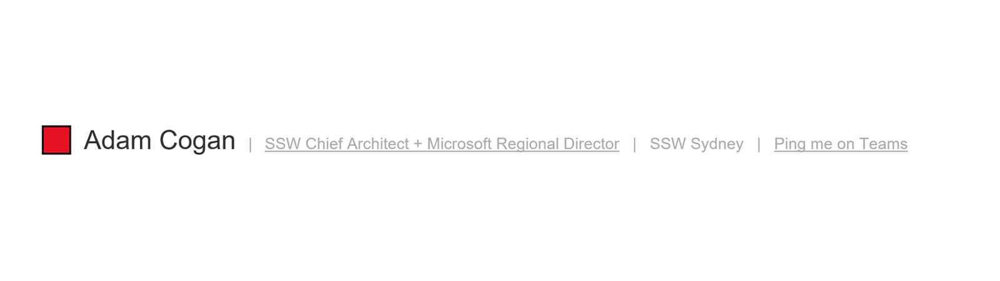
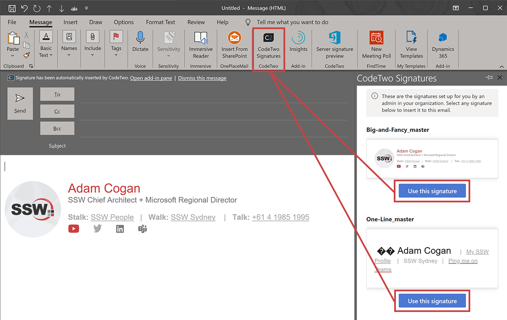
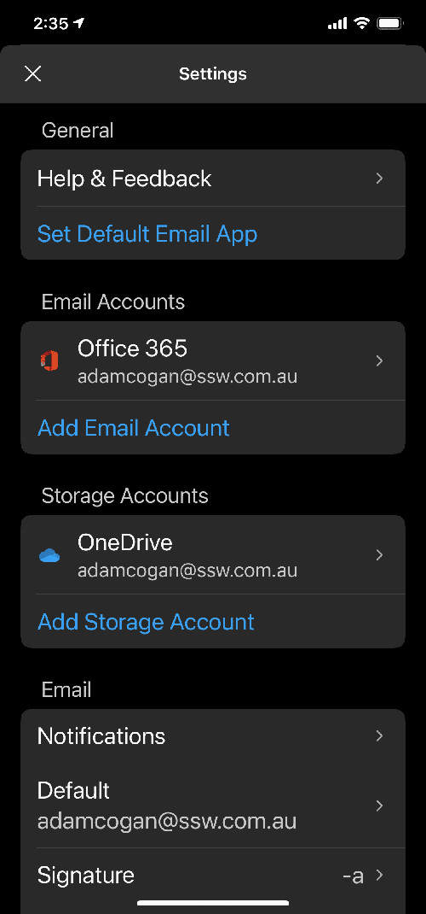
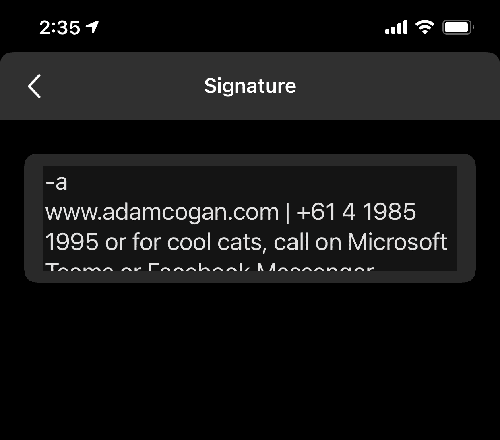
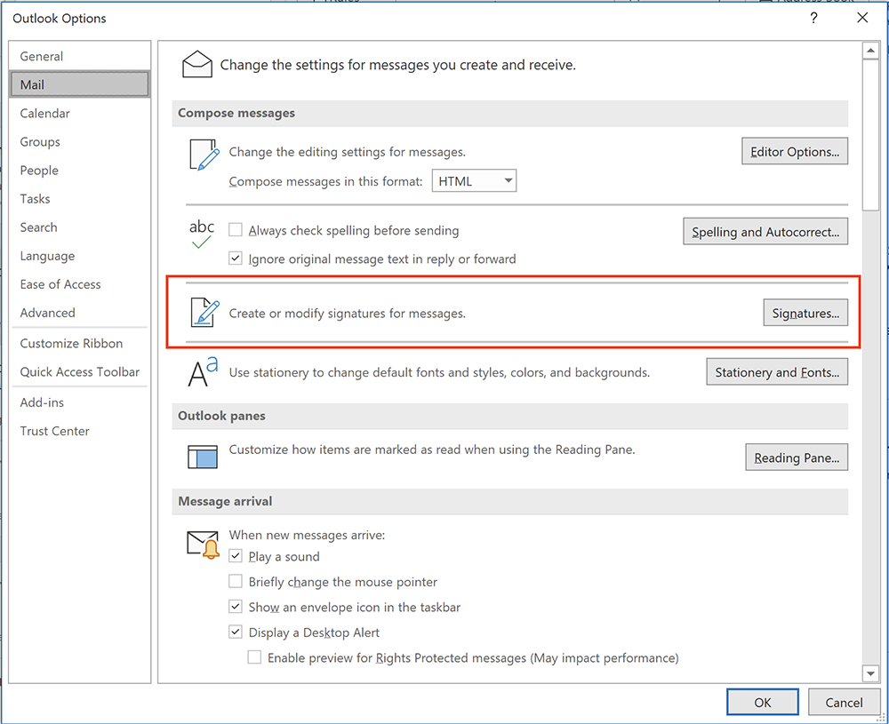
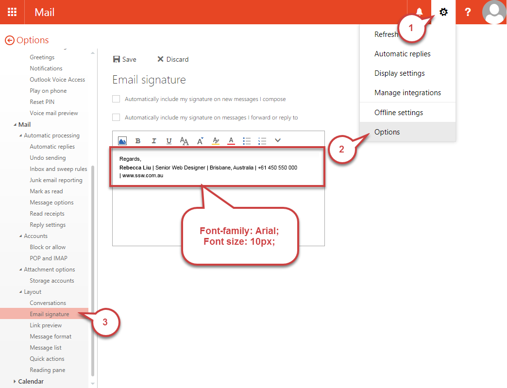
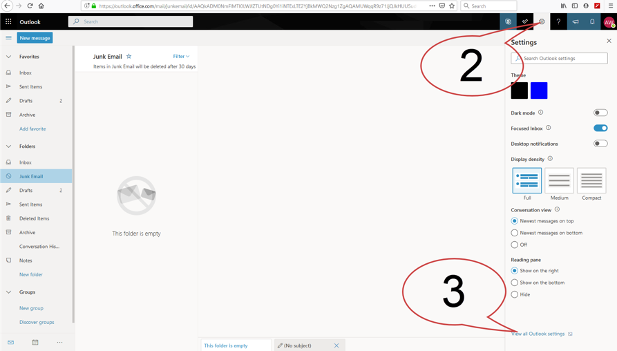

Email signatures are a great way of adding some advertising and branding. You should **always use a nice email signature for external emails**. Internally, you may use a short one (just your name or initials).

`youtube: https://www.youtube.com/embed/qwG8RA-cWy0`

<!--endintro-->

Full email signatures (for external recipients) are great when they have:

* A little **branding** and advertising (can be a tagline or company news), so people know instantly who it is from
  * You can **promote services or awards** at the bottom (e.g. "⭐️ [2023 Microsoft Partner of the Year Finalist](https://www.ssw.com.au/SSW/Consulting/Case-Study/Shepherd-Centre.aspx)")
* Your **phone number** (in international format - it's important to add the country code so people from all around the world can easily add you to their contacts - as per [the right format to show phone numbers](/do-you-know-the-right-format-to-show-your-phone-number))
* Your company **website link** (e.g. www.ssw.com.au)
* Your **social media** and **blog** link
* Your **IM** link (e.g. [Teams](https://www.msoutlook.info/question/teams-chat-link-in-email-signature) or [Facebook Messenger](https://medium.com/@michael_at_message/getting-a-facebook-messenger-link-and-messenger-code-dc27ee70a172))
* Your **position**
* Your **location** (city/country) where you are based

::: info
**Note:** You [can't add hyperlinks to signatures if you are using the Outlook App](https://answers.microsoft.com/en-us/outlook_com/forum/all/add-hyperlink-to-outlook-signature-on-iphone-and/56edcf68-a1ba-43c1-80cc-49b3248b25e8) – what a shame.
:::

### Mobile Signature

Use the **mobile signature** when sending emails from your phone. Mobile signatures are not easily customized so they can be simpler.

::: greybox
Get Outlook for Android
:::
::: bad
Figure: Bad example - The default signature
:::

::: greybox
Thanks, Adam  
www.ssw.com.au | [+61 2 9953 3000](tel:+61299533000) | [Ping me on Teams](https://teams.microsoft.com/l/chat/0/0?users=adamcogan@ssw.com.au)
:::
::: good
Figure: Good example – Custom signature with name, URL, phone number, and IM link
:::

### PC Long Signature (Big and Fancy)

Use the complete **long signature** when sending a new email or appointment to a client.

This is created in HTML and goes well on emails with Word used as the email editor. Include some product advertising, like what's new on your monthly newsletter. It should have the company colors.

However, you shouldn't use your long signature on **every** sent email. It's recommended to have a simpler version for internal emails and appointments:

### PC Short Signature

Use a really **short signature** (your first name or initials) or no signature at all in internal emails  as people already know who you are. You may want to add a quick link to IM.

::: greybox 
**Note:** "Ping me on Teams" is a link that directly opens chat with the person as per [Teams Hyperlinks on Outlook Signature
](https://learn.microsoft.com/en-us/answers/questions/197688/teams-hyperlinks-on-outlook-signature).
:::

## Implementation

### Option 1: CodeTwo (Paid)

The easiest way to implement consistent signatures across a company is to use a 3rd party signature provider e.g. CodeTwo.com and Exclaimer.com\
This way you quickly get great email signatures, with consistent branding, to all your employees and on all their devices. CodeTwo is cheaper and has a nicer design tool UI than Exclaimer, however they are both good. CodeTwo is built on Microsoft technology.

CodeTwo (and Exclaimer) give: 

1. Automatic signatures are added on any device – from laptop to smartphones
2. Consistent signatures for every employee as they all use one template – [consistency is important](/do-you-understand-the-value-of-consistency)
3. Management via a portal
4. Marketing can run campaigns and schedule changes to all signatures
5. Hassle-free setup – users do not need to touch any signatures on any devices. 

  

::: info 
Note the plugin currently does not work for Appointments due to a limitation in Outlook. Rules must be manually changed in Exchange Online to include appointments in the server-side version of CodeTwo. Once this has been configured do not manually copy your signature into an appointment or you will get 2 signatures. 
:::

### Option 2: Set it up manually (Free)

**Mobile - How to set it up in the Outlook App**

1. Go to Settings on the Outlook application
2. Click on Signature
3. Type your desired signature for mobile

  

  

### PC - How to set it up in Outlook

1. Open Microsoft Outlook and go File | Options
2. Click the "Mail" tab as seen below
3. Click on "Signatures..." and add in your signatures

  

### Browser - How to set it up in OWA

1. Open OWA (e.g. http://mail.northwind.com/owa)
2. Click "Options" on the top right side. 
3. Go Settings | Mail and make following changes: 

  

### How to set it up in Office 365

1. Open Outlook in Office 365 ([http://outlook.office.com/mail/inbox](https://outlook.office.com/mail/inbox))
2. Click the "Settings" cog on the top right corner of the Window
3. Click on “View all Outlook settings” at the bottom of the Settings panel 

  

4. In the "Settings" window that pops up, go to: Mail | Compose and reply.
5. Add your email signature and click "Save"

::: info
**Warning:** Unfortunately, you need to setup up your signature in Outlook and OWA. There is no way to share this.

**SSW Only:** You can automatically have your Outlook signature changed on sign-in via [SSW login script](https://github.com/SSWConsulting/LoginScript). 

**Note:** This does not setup your signature on OWA or your mobile signature.
:::
