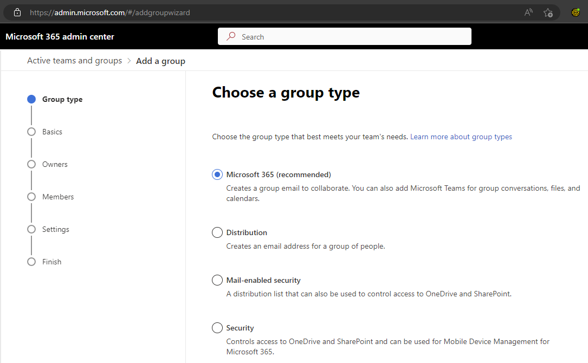
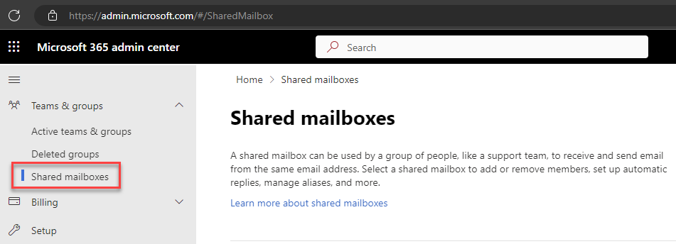

In Microsoft 365, there are 6 different types of groups you can create - so it is important to know how to decide which group to create.  

The groups available in Microsoft 365 are:  

1. Microsoft 365 Groups
2. Distribution groups
3. Security groups
4. Mail-enabled security groups
5. Shared mailboxes
6. Dynamic distribution groups

<!--endintro-->

### Microsoft 365 Groups

Microsoft 365 groups are for collaboration between members of the group. When you create a Microsoft 365 group, you get a number of shared resources - including an inbox, a calendar, and a shared workspace for files. You can create a Microsoft 365 Group with or without a Team attached to it - or you can add a Team later.

Microsoft 365 Groups are recommended by Microsoft, and they are often the best choice if you're not sure which group type to choose.

### Distribution groups

Distribution groups are the way to go if you just want to be able to email a number of people at the same time. They lack the collaboration features of a Microsoft 365 group, but sometimes you don't need these extra bits.

It's also worth noting that Distribution groups can be [upgraded to Microsoft 365 Groups](https://learn.microsoft.com/en-us/microsoft-365/admin/manage/upgrade-distribution-lists?view=o365-worldwide), so you can change your mind later.

### Security groups

Security groups do not provide email, or any sort of collaborative tools. They are used to grant access to resources, such as SharePoint or Azure resources. This makes managing access easier, as you don't have to add individual accounts - and when you remove someone from the group, their access is removed from everywhere that group had access.

Naming security groups is particularly important, so that you know what it is and what it is used for. These should be prefixed with **SEC_** and should clearly show what the group is used for, for example **SEC_VPNUsers**.

### Mail-enabled security groups

Mail-enabled security groups are - you guessed it - security groups with mail enabled. They are useful if you want to grant access to a resource and email the people with that access.

### Shared mailboxes

Shared mailboxes are used when multiple people need to access the same mailbox. They are useful when there is a shared role, e.g. a reception desk. They also include a calendar that can be used by everyone with access to the mailbox. 

Shared mailboxes are also useful as they give you a mailbox without taking up one of your Exchange online licences.

### Dynamic distribution groups

Dynamic distribution groups are created in the Exchange admin center.

Unlike regular distribution groups that contain a defined set of members, the membership list for dynamic distribution groups is calculated each time a message is sent to the group, based on the filters and conditions that you define. When an email message is sent to a dynamic distribution group, it's delivered to all recipients in the organization that match the criteria defined for that group.

- - -

You can read more about groups in Microsoft 365 in [Microsoft's documentation](https://learn.microsoft.com/en-us/microsoft-365/admin/create-groups/compare-groups?view=o365-worldwide).