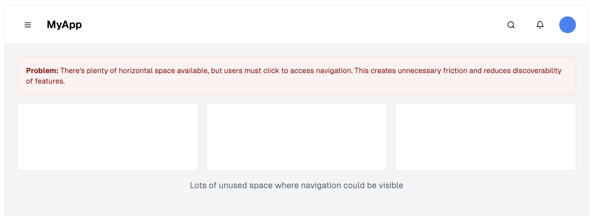
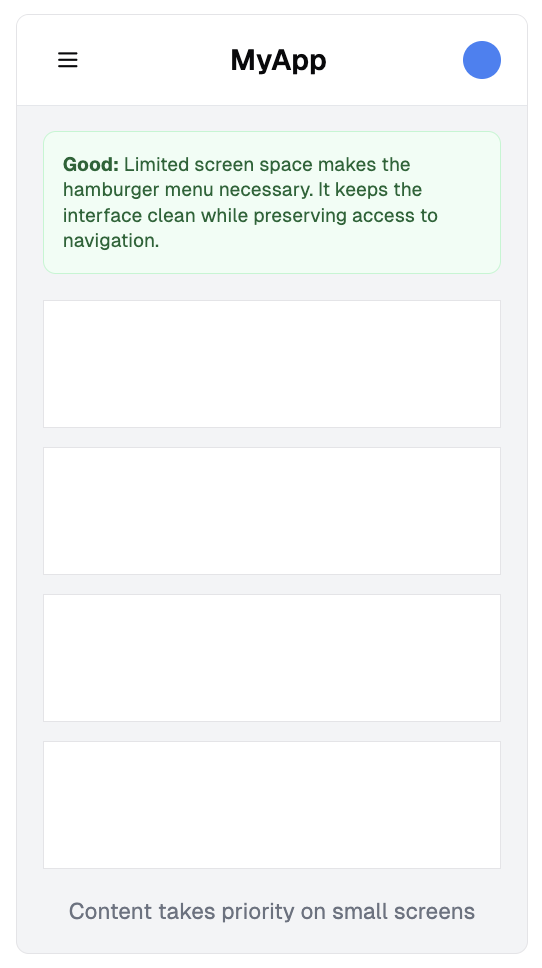

Hamburger menus are everywhere. They are popular and they declutter mobile UIs but the downside is that the menu items are less discoverable and require an extra click.

<!--endintro-->

`youtube: https://www.youtube.com/embed/1au4Gff9cSo`
**Video: Hamburger Menu Icon Update (3 min)**

## When should you use a hamburger menu?

Use it **only when screen space is tight** (typically on mobile). Otherwise, always prefer showing navigation visibly.

::: bad

:::

::: good img-medium

:::

### ✅ Best practices

* Users expect the hamburger menu to be in the **top left** - see microsoft.
* Use the **standard 3-line icon** – don't reinvent it
* Include a **toggle state** that turns into a cross.
* If you only have a logo + menu, favor **left placement** for branding and visibility.

Hamburger menus rock! Especially on mobile.
