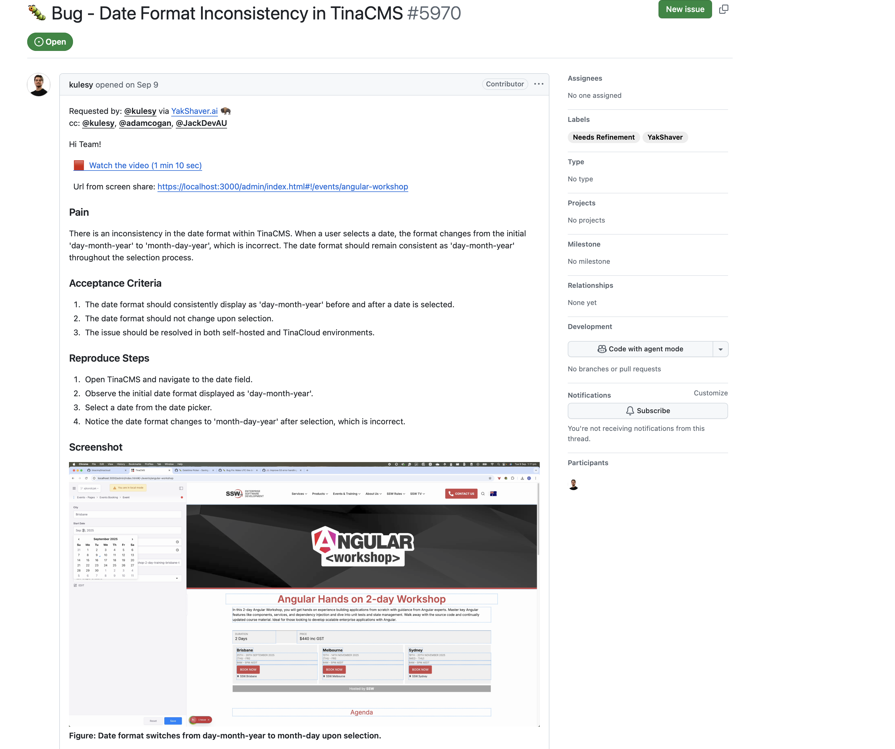
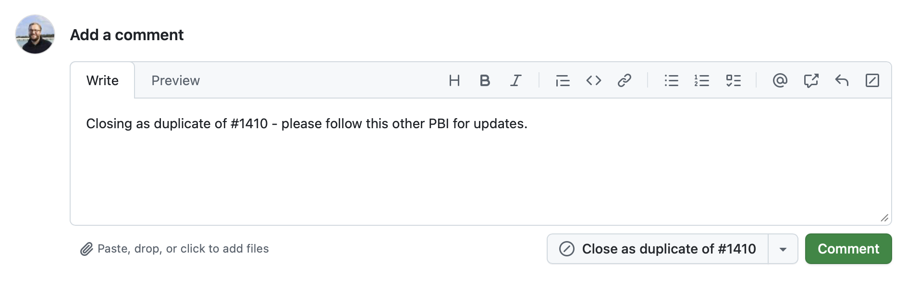

When working on a GitHub backlog, it’s common for multiple Product Backlog Items (PBIs) to be raised about the same issue, especially when several people encounter it independently.

Duplicates clutter the backlog and can lead to wasted effort. A clean backlog is easier to maintain. But it's also important to make sure everyone stays informed on their reported issues.

<!--endintro-->

## Why you should close duplicate PBIs

A cluttered backlog slows progress and makes it hard for the team to focus on what matters most. Keeping duplicates open leads to a messier and harder to manage backlog, which can mean time wasted and discussion fragmented across these issues.

The best practice is to close duplicate PBIs so that there is **only one active PBI per issue**. This ensures all relevant details, conversations, and notifications remain centralized, while still ensuring everyone who reported the issue stays informed.

### Keep bug reporters informed

When a PBI is closed as a duplicate, the person who raised it will **not** automatically receive updates when the main issue is completed. To maintain transparency and show respect for the bug reporter’s contribution, always ensure they are kept informed.

The simplest way to do this is to **@mention the reporting user** in the main (active) PBI when closing the duplicate. This ensures they receive notifications about progress and resolution.

## How to manage duplicate PBIs

### 1. Identify the main (active) PBI

Choose the most complete or best-discussed PBI as the primary one to keep open. It should have the clearest description, relevant discussion, and active tracking.

::: good

:::

### 2. Close and link the duplicate PBIs

Once you’ve identified the main PBI, close the others as duplicates. In GitHub, there are two standard ways to do this:

* Add a comment in the format of **"Duplicate of #101"**, then close the issue manually, or  
* Use GitHub’s **"Close as duplicate"** feature (available when referencing another issue in the comment)

Both methods automatically link the issue to the active PBI and make the relationship clear to other users.

::: greybox
**Comment:** "Duplicate"
:::
::: bad
Figure: Bad example - The issue is closed abruptly without context, which confuses the reporter
:::

::: greybox
**Comment:** "Duplicate of #101 - follow here for further updates"
:::
::: good
Figure: Good example - Using the built-in GitHub duplicate workflow keeps issues linked and easy to trace
:::

::: good

:::

### 3. Notify the users who created the duplicates

Since closing their PBI means they won’t receive future updates automatically, it’s essential to @mention those users in the main PBI so they know when the issue is resolved.

::: greybox
Comment on #101:  
> "@jane @sam closing your related issues (#102, #103) as duplicates. You’ll be notified here when this issue is resolved."
:::
::: good
Figure: Good example - All reporters are acknowledged and notified when the main PBI is completed
:::

## Automate where possible

If your project frequently encounters duplicates, consider automating this workflow:

* Use GitHub Actions or bots to suggest duplicates automatically based on title or description similarity
* Add a checklist to your **PBI template** reminding team members to search for existing issues before creating new ones

---

### Summary

* Keep one active PBI per issue
* Link duplicates clearly
* Notify all reporters on completion

By consistently managing duplicates this way, your backlog stays clean and nobody is kept in the dark on their reported issues.
