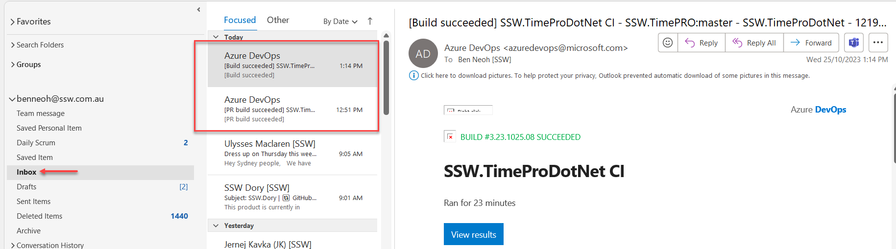
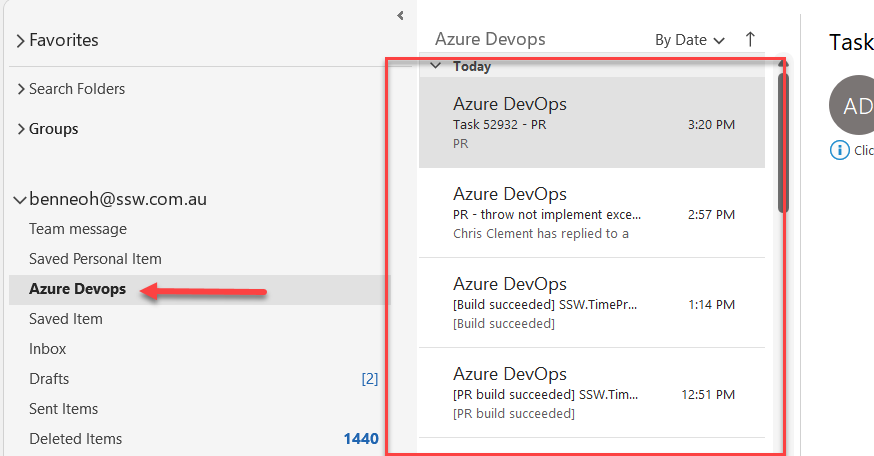

<!--endintro-->

Emails that are automatically generated can quickly overload your inbox with less important messages e.g. notifications from Microsoft Teams, GitHub, Azure Devops, etc.

**❌ Figure: Inbox with noise from Azure Devops**

You can create a folder and rules in your Microsoft Outlook to move noisy emails out of the inbox based on the sender. [This article](https://support.microsoft.com/en-gb/office/always-move-messages-from-a-specific-sender-e28d03c0-077d-4366-a348-4536f0fc9008) shows how to move messages from specific senders.

**✅ Figure: Using a rule we can move noisy Azure DevOps emails to a newly created folder**
