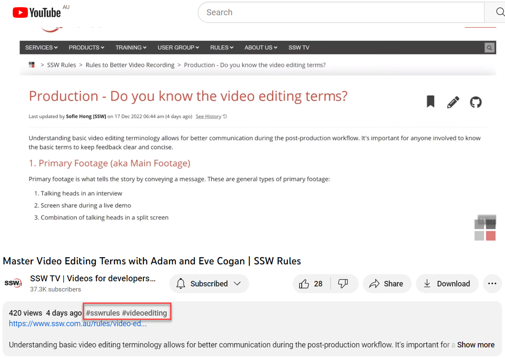

YouTube has introduced hashtags to video descriptions, where videos are then grouped in hashtag pages. This optimises search results as you'll be able to search videos using hashtags, which can result in a higher engagement since you will have a wider range of users.

For example, if you are uploading a video about SSW Rules, including the hashtag **#sswrules** will group all related video content in one search page when you click on the hashtag.

<!--endintro-->

When uploading your video on YouTube and creating the description, don't forget to add relevant hashtags to increase your video reach 😊

::: greybox
**Tip:** If the hashtags aren't appearing at the top of your description, remove your location - having both creates a conflict. 
:::

Watch this video for a simple explanation: 

`youtube: https://www.youtube.com/watch?v=F06MV1qm51Y`
**Video: Youtube Hashtags included in description** 

