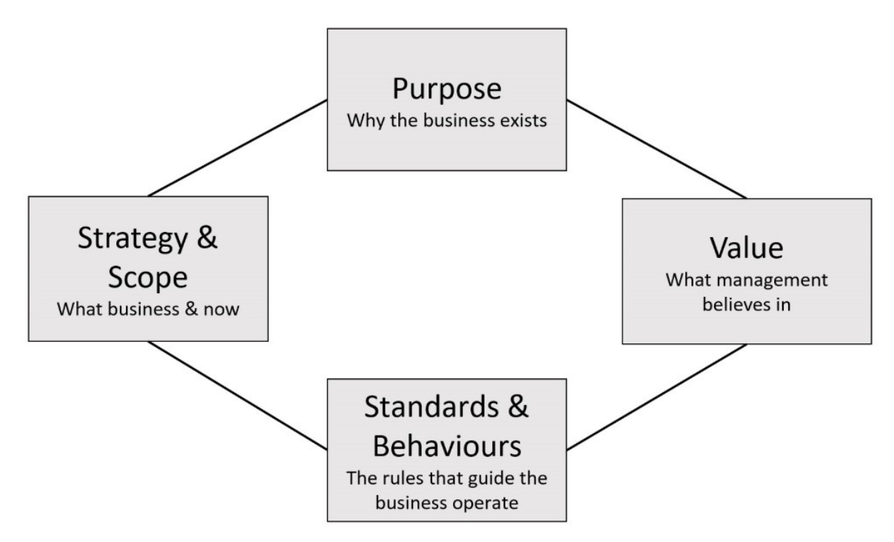

To ensure everyone is on the same page, you can create a mission statement that continually drives your marketing plan. Is a short statement that outlines why your organization exists, what its overall goal is and it identifies the goal of its operations, e.g. what kind of product or service it provides, its primary customers or market, and its geographical region of operation and target audience. 

<!--endintro-->

A good mission statement can help in three main ways:

* It provides an outline of how the marketing plan should seek to fulfill your overall goals/mission
* It provides a means of evaluating and screening your marketing plan; e.g. are your daily marketing decisions consistent with the overall mission
* It provides an incentive to implement the marketing plan, and keep updating and improving it

::: info
For example, SSW Mission Statement is at [About Us page](https://www.ssw.com.au/ssw/company/AboutUs.aspx).
:::
