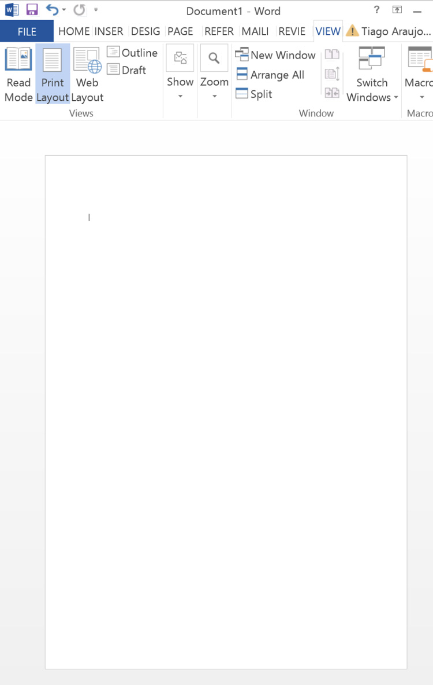
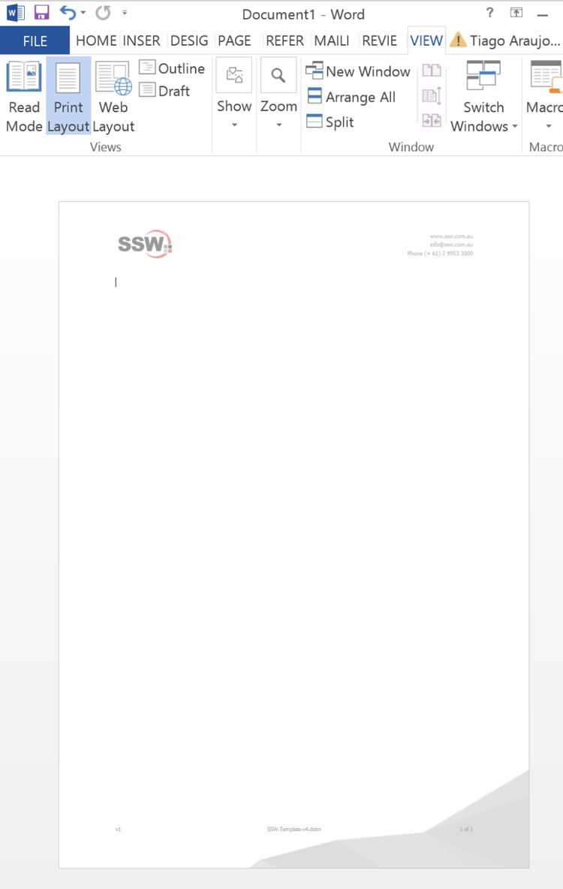

A company-wide Word template brings many benefits e.g.:
* **Consistency** - It's [important to maintain consistency](/do-you-understand-the-value-of-consistency) on documents internally and for clients
* **Automatic footers and headers** - Showing the latest edit time and who the editor was, updating automatically on save
* **Branding** - More and better branding and correct company colors

<!--endintro-->

::: bad  
  
:::

::: good  
  
:::

How to have a company-wide Word template:

* Modify your Normal.dotm file to have the headings and format that you want for Word document
* Create standard employee email footer files e.g. `JamesZhou.htm` or `JamesZhou.txt`
* Put the files on a network location - this is the place that will have the master copies
* Have a logon script which is set up through Group policy that will copy the file to the users' computer when they logon

```powershell
ECHO Copy Office Templates To Workstation >> %LogonLogFile%
call %ScriptFolder%\SSWLogonScript\BatchScript\SafeCopyNewerFile.bat "\\fileserver\DataSSW\DataSSWEmployees\Templates\Normal.dot" "%APPDATA%\Microsoft\Templates\Normal.dot" %LogonLogFile%
call %ScriptFolder%\SSWLogonScript\BatchScript\SafeCopyNewerFile.bat "\\fileserver\DataSSW\DataSSWEmployees\Templates\Normal.dotm" "%APPDATA%\Microsoft\Templates\Normal.dotm" %LogonLogFile%
call %ScriptFolder%\SSWLogonScript\BatchScript\SafeCopyNewerFile.bat "\\fileserver\DataSSW\DataSSWEmployees\Templates\ProposalNormalTemplate.dotx" "%APPDATA%\Microsoft\Templates\ProposalNormalTemplate.dotx" %LogonLogFile%
call %ScriptFolder%\SSWLogonScript\BatchScript\SafeCopyNewerFile.bat "\\fileserver\DataSSW\DataSSWEmployees\Templates\NormalEmail.dot" "%APPDATA%\Microsoft\Templates\NormalEmail.dot" %LogonLogFile%
call %ScriptFolder%\SSWLogonScript\BatchScript\SafeCopyNewerFile.bat "\\fileserver\DataSSW\DataSSWEmployees\Templates\Microsoft_Normal.dotx" "%APPDATA%\Microsoft\Templates\Microsoft_Normal.dotx" %LogonLogFile%
call %ScriptFolder%\SSWLogonScript\BatchScript\SafeCopyNewerFile.bat "\\fileserver\DataSSW\DataSSWEmployees\Templates\Blank.potx" "%APPDATA%\Microsoft\Templates\Blank.potx" %LogonLogFile%
xcopy /Y "\\fileserver\DataSSW\DataSSWEmployees\Templates\NormalEmail.dotm" "%APPDATA%\Microsoft\Templates\" >> %LogonLogFile%
xcopy /Y "\\fileserver\DataSSW\DataSSWEmployees\Templates\NormalEmail.dotx" "%APPDATA%\Microsoft\QuickStyles\" >> %LogonLogFile%
ECHO Templates Copied
```

::: bad
Figure: Bad example - This is a snippet of an old login script  
:::

::: greybox
You can automatically have your SSW Word doc template on sign-in via a script. E.g. [PowerShell login script](https://github.com/SSWConsulting/SSWSysAdmins.LoginScript).
:::
::: good
Good example - New Login script on Github  
:::

**Note #1:** We don't want people using .RTF emails.

**Note #2:** If you use a Mac computer, a login script will not work. In order to use a Word template, you must open the template on Word locally, hit "Save as Template", and then upload that document to Teams.
