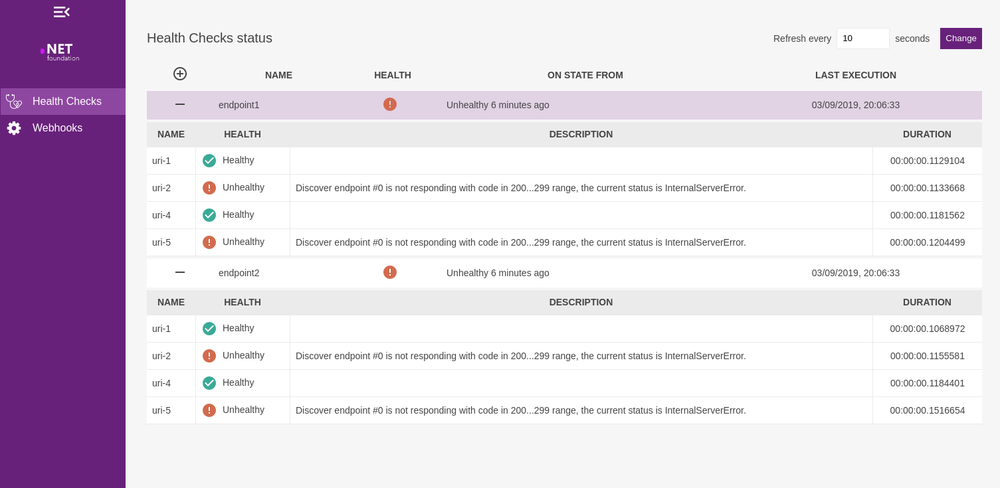
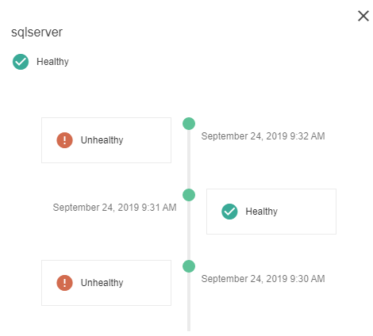
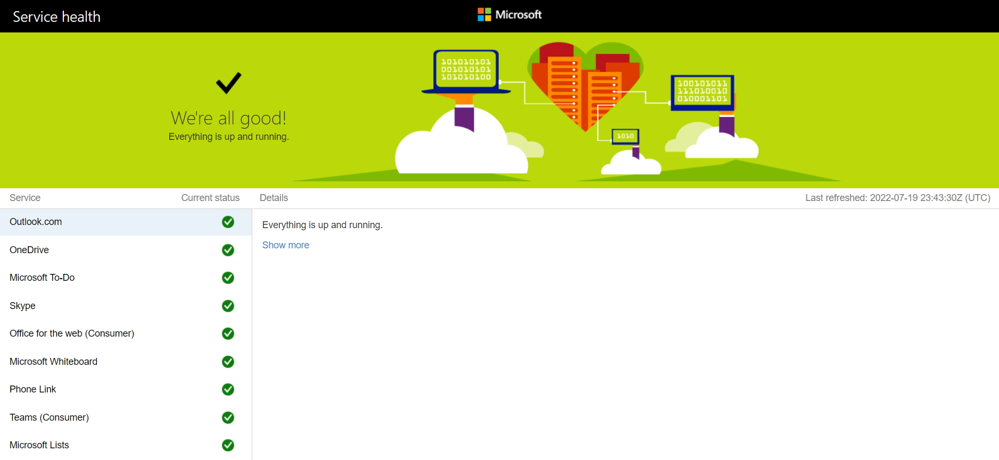
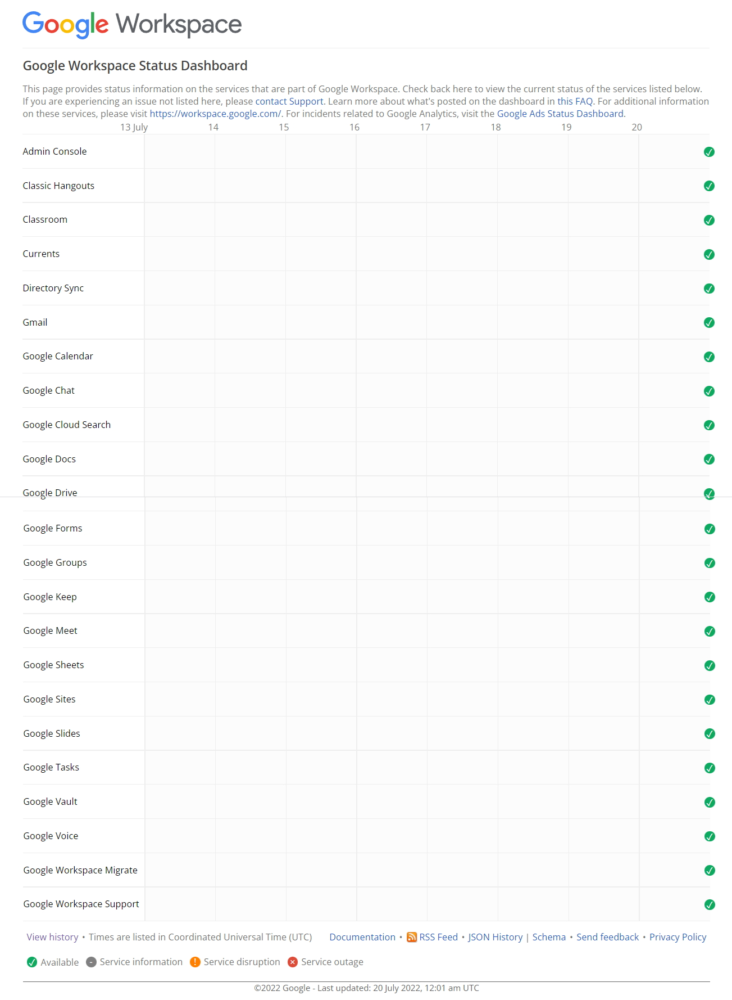
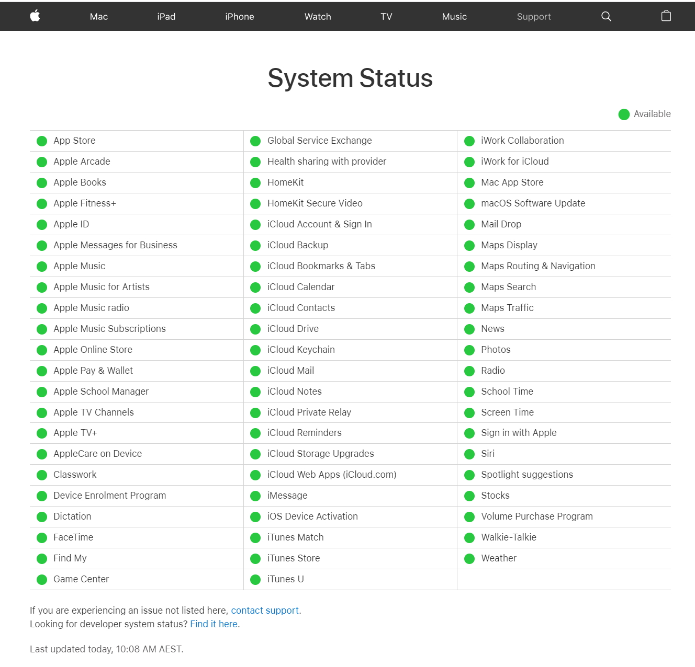
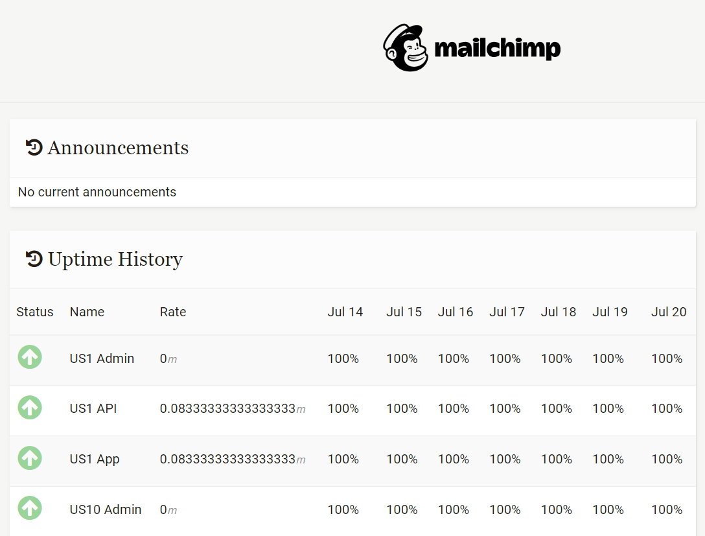

Websites can be complicated, and a very small mistake can take the whole site down. But there are two different kinds of errors, coding errors and deployment errors; coding errors should be picked up by compiling and debugging, while deployment errors should be picked up by the HealthCheck page.

Whenever there is a deployment problem, instead of fixing it straight away, we find out what the cause of the problem is and create a HealthCheck test to prevent it from happening again. So next time, when the site is down or re-deployed to a new server, we can simply run the HealthCheck page and fix all red crosses then the site should be back online.

<!--endintro-->

.NET Core has the ability to add a health check to your application and can be configured for a variety of real-time monitoring scenarios:

* Health probes can be used by container orchestrators and load balancers to check an app's status. For example, a container orchestrator may respond to a failing health check by halting a rolling deployment or restarting a container. A load balancer might react to an unhealthy app by routing traffic away from the failing instance to a healthy instance.
* Use of memory, disk, and other physical server resources can be monitored for healthy status.
* Health checks can test an app's dependencies, such as databases and external service endpoints, to confirm availability and normal functioning.

See more at [Health checks in ASP.NET Core](https://docs.microsoft.com/en-us/aspnet/core/host-and-deploy/health-checks?view=aspnetcore-3.1).

If you need to add a UI to the health check system - we recommend checking out [spNetCore.Diagnostics.HealthChecks
Public](https://github.com/Xabaril/AspNetCore.Diagnostics.HealthChecks).

It includes NuGet packages that make it easy to test the health of the lots of different endpoints, and you can push the health check results to different logging platforms e.g. Application Insights, DataDog, etc
 
It also includes UI (which is themable) and the UI supports automatic discovery of k8s services exposing pods that have health checks endpoints. This means you can benefit from it and avoid registering all the endpoints you want to check and let the UI discover them using the k8s API.
 
Best of all they have a [Release Gate available on the DevOps market place](https://marketplace.visualstudio.com/items?itemName=luisfraile.vss-services-aspnetcorehealthcheck-extensions) for the release pipelines.

  

  

### Other products using validation status

  

  

  

  

See [Do you have a HealthCheck page to test your website dependencies?](/have-a-healthcheck-page-to-test-your-website-dependencies)

