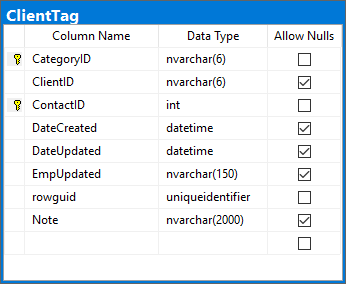
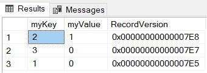

SQL Server rowversions are a data type available which are binary numbers that indicate the relative sequence in which data modifications took place in a database. See the MSDN article on rowversions here: [rowversion (Transact-SQL)](https://docs.microsoft.com/en-us/sql/t-sql/data-types/rowversion-transact-sql?view=sql-server-ver15)

<!--endintro-->

All tables should have a rowversion column called "RecordVersion" to aid concurrency checking. A rowversion improves update performance because only one column needs to be checked when performing a concurrency check (instead of checking all columns in a table for changes).


::: bad
Figure: Bad Example - No rowversion available in this table
:::

```sql
CREATE TABLE MyTest (myKey int PRIMARY KEY 
    ,myValue int, RecordVersion rowversion); 
GO
 
INSERT INTO MyTest (myKey, myValue) VALUES (1, 0);  
INSERT INTO MyTest (myKey, myValue) VALUES (2, 0); 
INSERT INTO MyTest (myKey, myValue) VALUES (3, 0); 
UPDATE MyTest SET myValue = 1 WHERE myKey = 2
 
SELECT * FROM MyTest ORDER BY RecordVersion DESC
```

::: good
Figure: Good Example - A create statement which builds a table with a rowversion

:::



::: good
Figure: Good Example - A set of records with a rowversion available  
:::
