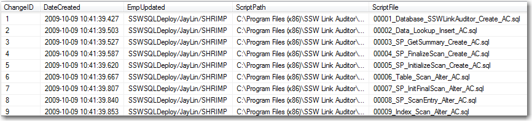

You have a web site master right? This is the central point of contact if the site goes down.
 When developing an application, all members can code. However schema changes being done by many developers often can lead to trouble. 

 Who is "Schema Master"? What does he do?   
<!--endintro-->

  

If your project has a database, you need to select a "Schema Master". This is the one person who should review all modifications to the database. These include:

* Creating, Modifying and Deleting tables and columns
* Relationships
* Modify [Controlled Lookup Data](/do-you-deploy-controlled-lookup-data)

 The "Schema Master" in a development shop is often the lead programmer on the team. They are in charge of all database changes and scripts. Team members should still feel free to make changes, just get them double checked by the Schema Master.     
  

